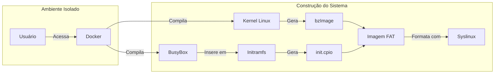
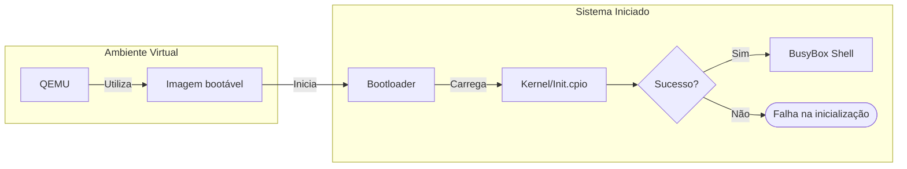

# **Base Inicial**

Este sistema servirá de base para a construção do sistema principal do framework, uma vez que, apesar de muito abstraído, oferece uma linha de raciocínio da montagem do sistema operacional mínimo com o kernel Linux, embora não utilize de ferramentas/componentes do ecossistema GNU.

---

## **Componentes**

Os componentes desse sistema mínimo são divididos em três itens:

* Kernel Linux 64-bit;
* BusyBox (userland);
* Syslinux (bootloader).

Devido ao nível elevado de abstração decorrido da utilização do BusyBox como userland (uma vez que substitui vários componentes como Coreutils em um único binário), ele não será utilizado no sistema final, mas servirá para nossa base mínima.

Além disso, a construção será feita dentro de um container docker rodando uma imagem de um sistema GNU/Linux, sendo utilizado, nesta versão, a `debian:trixie-slim`.

>Docker é um sistema utilizado para implantar aplicações em containers virtuais, permitindo o isolamento do sistema principal do usuário e garantir que o software execute da mesma forma, independente do dispositivo que está hospedando.


O fluxo desse trabalho consiste em:

### **Etapa 1 - Construção**


>Diagrama 1: Representação da sequência de construção do sistema e seus respectivos componentes, iniciando pelo acesso ao container `Docker` até a criação da imagem bootável com `Syslinux`.

### **Etapa 2 - Boot**



>Diagrama 2: Representação da sequência de inicialização do nosso sistema, iniciando pelo `QEMU` (sistema de virtualização) até o boot.

---

## **Iniciando a construção**

Para iniciarmos o desenvolvimento, é de extrema importância que criemos um ambiente virtual/isolado, uma vez que os comandos e tarefas realizados a seguir podem acabar afetando o seu sistema principal/host. Para isso, temos as opções de se utilizar as seguintes tecnologias:

* **Docker** - utilizando um container privilegiado (`--privileged`) e interativo (`-it`);
* **Máquina virtual** - utilizando um sistema virtualizado completo para estar realizando as etapas do tutorial.

O método fica de livre escolha do utilizador, mas por fins de praticidade, recomenda-se a utilização do container **Docker**, uma vez que já fornece o sistema isolado necessário para se realizar o trabalho completo, além de ser o método utilizado neste tutorial, facilitando o acompanhamento. A partir desse sistema virtualizado, podemos seguir com o processo.

| Método | Segurança | Praticidade | Tamanho |
| :--: | :--: | :--: | :--: |
| Container (Docker) | Boa | Excelente | Leve |
| Máquina Virtual | Excelente | Mediana | Pesado |
>Tabela 1: Comparativos de abordagens para seguir o tutorial em um ambiente isolado, comparando o sistema `Docker` com máquina virtual.  


Além disso, o tutorial assume um ambiente GNU/Linux para o seu desenvolvimento, embora seja completamente possível de se realizar no ecossistema Windows graças a alternativas como o `WSL` presente no sistema.

Com as informações repassadas, podemos dar início à montagem do sistema. Para começar, tendo o Docker já instalado, inserimos o seguinte comando para inicializar nosso ambiente isolado para o desenvolvimento do projeto:

```bash
docker run --privileged -it debian:trixie-slim
```

A diretriz `--privileged` garante ao container um acesso maior a recursos do sistema, sendo necessários em etapas importantes do processo. Já a diretriz `-it` garante que o container será interativo, permitindo utilizar o seu terminal para baixarmos arquivos e executarmos comandos.

Já dentro do container, após executarmos o comando anterior, iniciamos a rotina atualizando o repositório de pacotes:

```bash
# Atualiza o repositório de pacotes 'apt' (padrão do Debian)
apt update
```

>Não utilizaremos nenhum `sudo` neste processo (comando que permite usuários comuns executarem comandos como administador), uma vez que o container já nos joga como usuário `root` (administrador), facilitando o processo da construção.

Seguimos o processo para a etapa de instalação, onde estaremos fazendo o download de componentes necessários para a construção:

```bash
apt install bzip2 git vim make gcc libncurses-dev flex bison bc cpio libelf-dev libssl-dev
```

Sendo desses componentes:

* **bzip2** - Necessário para o BusyBox, servindo para compactar e descompactar arquivos;
* **git** - Clone dos repositórios do kernel Linux e do BusyBox;
* **vim** - Editar/criar arquivos;
* **make, gcc** - Necessários para a compilação de código em linguagem C;
* **flex, bison, bc, libelf-dev, libssl-dev** - Necessários para o kernel, onde:
  * **flex**: ferramenta que cria programas capazes de reconhecer os elementos básicos de uma linguagem, como palavras-chave, números e símbolos.
  * **bison**: ferramenta que cria programas responsáveis por analisar como esses elementos se relacionam, verificando se a estrutura da linguagem está correta.
  * **bc**: calculadora utilizada durante a compilação do kernel para realizar operações matemáticas automaticamente.
  * **libelf-dev**: biblioteca necessária para manipular arquivos executáveis no formato ELF.
  * **libssl-dev**: biblioteca que fornece recursos criptográficos usados na assinatura e verificação de componentes do kernel.
* **cpio** - Componente que permite a criação do `initramfs`.

---

## **Compilando o kernel Linux**

Após todos os preparativos, iniciaremos a configuração e compilação do kernel Linux -- a espinha dorsal do sistema operacional. Para isso, iniciaremos clonando o mirror do GitHub:

```bash
git clone --depth 1 https://github.com/torvalds/linux.git
```

A diretriz `--depth 1` nos garante que não clonaremos o histórico git completo, somente o último commit.

>Kernel, como mencionado antes, é a "espinha dorsal" do sistema operacional, pois é ele quem coordena as chamadas de sistema e gerencia a comunicação entre o software e o hardware.

Com isso, após a clonagem do repositório for concluída, podemos acessar o diretório `/linux` que contém o repositório clonado.

```bash
# cd: Change Directory - nos permite acessar o diretório indicado
cd linux
```

Feito isso, iremos iniciar um pequeno ajuste na configuração do kernel inserindo o seguinte comando:

```bash
make menuconfig
```

>Se você estiver rodando no terminal do `VSCode` ou em uma janela pequena, o seguinte erro pode acontecer: **"Your display is too small to run Menuconfig! It must be at least [...]"**. Caso ocorra, basta aumentar o tamanho do terminal e a interface irá aparecer normalmente.

Este comando abrirá uma interface onde, logo abaixo de "General Setup", tenha certeza de deixar a opção de "64-bit kernel" ativa (barra de espaço). Tendo feito, está tudo pronto, basta apertar a tecla `Tab` para alterar a opção para sair e `Enter` para confirmar.

<div align="center">


</div>

>Imagem 1: Interface de configuração `menuconfig`, indicando a opção do kernel de 64-bit que deve estar habilitada.

Com a configuração feita, chegou a hora de compilar o kernel Linux, utilizaremos o seguinte comando:

```bash
make -j$(nproc)
```

O comando `make` é o que inicia o processo da compilação através da configuração do Makefile presente, porém, a diretriz `-j$(nproc)` permite que utilizemos todos os núcleos presentes na máquina, auxiliando no processo de compilação para que não leve tanto tempo.

O processo de compilação serve para gerar o arquivo binário que será utilizado na construção do nosso sistema (sempre utilizamos binários para construir).

Após a compilação, nos será retornardo o caminho onde a imagem está guardada -- neste tutorial, é em `arch/x86/boot/bzImage`, sendo `bzImage` o nosso kernel que acabamos de compilar (como indicado no **Diagrama 1**). Neste caso, criaremos um novo diretório onde iremos armazenar os arquivos e componentes que serão utilizados na construção:

```bash
# primeiro criaremos o novo diretório utilizando 'mkdir' - Make Directory'
mkdir /boot-files

# seguido de copiar o arquivo binário do kernel Linux compilado para ele utilizando 'cp [ARQUIVO] [DESTINO]' - cp: Copy
cp arch/x86/boot/bzImage /boot-files

# após, podemos sair do diretório atual (linux) COM '..'
cd ..
```

Tendo feito isso, podemos verificar o diretório `boot-files` presente na raiz:

```bash
# utiliza o comando 'ls' (list) para verificar o conteúdo no diretório atual
ls

# utiliza 'ls [DESTINO] para verificar o conteúdo de um diretório específico
ls boot-files
```

Com o diretório criado e contendo o binário do kernel compilado dentro dele, estaremos indo para a próxima etapa: a construção da **Userland/User space**.

---

## **Compilando o BusyBox**

Após os preparativos com o kernel, iremos agora iniciar o processo de compilação para a criação da `userland`, permitindo o usuário de interagir com o sistema.

> A userland (ou `user space`) é tudo que executa fora do kernel do sistema operacional, se referindo a programas e bibliotecas que permitem o sistema operacional a interagir com o hardware, como programas que realizam entrada/saída de dados, manipulam sistemas de arquivos, etc.  


Para isso estaremos utilizando o **BusyBox**, um conjunto de utilitários reunídos em um único binário, facilitando no processo de compilação e montagem da nossa distribuição -- o canivete suíço para distribuições minimalistas.

A seguir, iniciaremos o processo clonando o repositório oficial do BusyBox:

```bash
git clone --depth 1 https://git.busybox.net/busybox 
```

Feito o clone do repositório, iremos acessar o diretório do BusyBox para realizarmos, assim como no kernel Linux, uma configuração antes da compilação com `make menuconfig`.

```bash
cd busybox

make menuconfig
```

Na interface, acessando a primeira opção "Settings", descendo algumas opções, encontraremos na sessão `---Build options` a opção `Build static binary (no shared libs)` desmarcada, sendo necessário habilitar para evitar utilizar bibliotecas externas.

<div align="center">


</div>

>Imagem 2: Opção indicada para habilitar o `build estático` do BusyBox.

Após, podemos sair desta tela, mas ainda resta uma configuração a ser realizada. De volta a tela inicial do `menuconfig`, mais abaixo, entraremos na opção `Network utilities` e, descendo bem a página, encontraremos o item `tc` habilitado, o que pode acabar causando algum conflito na compilação, por isso, para este tutorial, deixaremos desabilitado.

<div align="center">


</div>

>Imagem 3: Indicando a sessão `Network utilities`.

<div align="center">


</div>

>Imagem 4: Indicando a opção `tc` a ser desmarcada.

Feitas as configurações, podemos enfim compilar o BusyBox:

```bash
make -j$(nproc)
```

Após a compilação, criaremos o diretório do `initramfs`, onde instalaremos o BusyBox que compilamos:

```bash
# criamos o diretório
mkdir /boot-files/initramfs

# em seguida, instalamos o BusyBox com o comando 'make install'
# 'CONFIG_PREFIX': serve para passar o local onde será instalado
make CONFIG_PREFIX=/boot-files/initramfs install
```

O diretório `initramfs` representa o sistema de arquivos temporário carregado pelo kernel logo após o processo de boot. Nele colocaremos o BusyBox que, durante sua instalação, cria automaticamente parte da estrutura do `rootfs` (sistema de arquivos raiz), incluindo os diretórios `bin`, `sbin` e `usr`.

O diretório `bin` armazena comandos essenciais acessíveis a todos os usuários, `sbin` contém programas utilizados principalmente para administração do sistema, enquanto `usr` reúne aplicações, bibliotecas e outros arquivos compartilhados entre os usuários.

---

## **Sistema de inicialização**

Tendo o kernel e a userland (BusyBox) compilados, iremos criar então o sistema de inicialização. Dentro do diretório `/boot-files/initramfs`, iremos criar um arquivo de init simples.

```bash
# Entraremos no diretório 'initramfs'
cd boot-files/initramfs

# Criaremos o arquivo de inicialização
vim init
```

Dentro da interface do `Vim` (um editor de texto via terminal), apertaremos a tecla `I` para podermos criar o arquivo de init -- arquivo este que o kernel procura após carregar o `initramfs`.

Neste arquivo, iremos configurar para inicializar o `shell`:

```
#!/bin/sh

/bin/sh
```

Basicamente, os símbolos `#!` indicam ao kernel a utilizar o binário indicado -- `/bin/sh` -- para executar/iniciar o comando/componente indicado, que no caso, é o próprio shell.

Feito isso, podemos sair do editor apertando a tecla `Esc`, seguido de `:` e após `wq`, onde `:` ativa a sessão de comandos e `wq` significa 'Write and Quit', salvando nosso arquivo de init e saindo do editor.

Logo após, precisamos dar permissão de execução para o arquivo, uma vez que ele atuará como um script, o sistema necessita de que ele tenha a autoridade para ser executado, nos levando a:

```bash
chmod +x init
```

Onde `chmod` é o comando utilizado para alterar permissões de arquivos e diretórios, `+x` sendo a permissão adicionada (+) a de execução (x) e `init` o nome do nosso arquivo.

Em seguida, criaremos nosso arquivo de inicialização utilizando o `cpio`, uma ferramenta que empacota diversos arquivos e diretórios em um único arquivo. Esse arquivo será utilizado pelo kernel como `initramfs` durante os primeiros estágios da inicialização do sistema.

Para criar o arquivo, executaremos o seguinte comando:

```bash
find . | cpio -o -H newc > ../init.cpio
```

Onde pegamos todos os arquivos do diretório atual (`find .`), transformamos no tipo de arquivo que o kernel suporta (`-H newc`) através do cpio, inserindo tudo em um novo arquivo (`> ../init.cpio`), gerando nosso arquivo de inicialização.

---

## **Bootloader**

Nesta última etapa, estaremos configurando o Bootloader do nosso projeto, sendo o componente responsável por inicializar o sistema operacional. Neste tutorial, estaremos iniciando o Syslinux.

> `Bootloader` nada mais é que um software executado assim que o hardware liga, sendo o componente carregado logo após os testes realizados pela `BIOS/UEFI`, se responsabilizando por carregar tanto o kernel quanto o arquivo de inicialização -- `initrd/initramfs`.  


```bash
# Sair do diretório 'initramfs'
cd ..

# Instalar o Syslinux 
apt install syslinux
```

Com o bootloader instalado, podemos criar o arquivo de boot. Para isso, utilizaremos o seguinte comando para iniciar este arquivo:

```bash
dd if=/dev/zero of=boot bs=1M count=50
```

Simplificando, o comando nos permite criar um arquivo de 50MB preenchido de zeros que, posteriormente, será formatado e utilizado para armazenar os arquivos necessários para a inicialização do sistema. 

Aprofundando mais um pouco no comando:

* ele utiliza a ferramenta `dd` que serve para copiar dados brutos de uma origem para um destino;
* nesse caso, a origem (`if (input file)`) sendo `/dev/zero`, um diretório especial que contém teoricamente infinitos zeros, e o destino (`of (output file)`) sendo `boot`, que será preenchido com os zeros que copiaremos;
* com isso, o arquivo se torna uma espécie de "imagem de disco virtual";
* por fim, especificamos o tamanho dos blocos que serão copiados (`bs=1M (block size = 1 MB)`), espeficiando a copiar os zeros em blocos de 1MB, e a quantidade total de blocos (`count=50`), resultando em 50 blocos de 1MB -- totalizando 50MB.

Após criarmos o arquivo de boot (ainda não finalizado), podemos configurar o sistema de arquivos dele. Por utilizarmos Syslinux, estaremos utilizando o sistema FAT por ser o sistema que ele suporta.

```bash
# primeiro, instalamos:
apt install dosfstools

# feito isso, rodaremos o seguinte comando para configurar o sistema em nosso arquivo de boot:
mkfs -t fat boot
```

Onde `mkfs` "formata" o arquivo/dispositivo para que possa armazenar arquivos/diretórios, `-t` é a flag para indicarmos o tipo e `fat` o tipo de filesystem que desejamos, sendo configurados em nosso arquivo `boot`.

Após isso, podemos enfim configurar o nosso bootloader dentro do arquivo, uma vez que este apresenta um filesystem válido. Com o Syslinux já instalado, executamos o seguinte comando:

```bash
syslinux boot
```

Que, basicamente, indica para instalar o `Syslinux` no filesystem FAT presente no arquivo `boot`, completando assim o nosso arquivo contendo o bootloader (como indicado no **Diagrama 1**, na sessão "Construção do Sistema").

---

## **O boot**

Finalizando o processo, iremos enfim fazer a imagem bootável do nosso sistema. Para isso, precisamos copiar o kernel e o initramfs para dentro do arquivo de boot, sendo feito de uma maneira bem simples:

```bash
# primeiro, criamos um diretório novo para trabalharmos em cima
mkdir m # pode ser qualquer nome

# em seguida, iremos montar o arquivo de boot neste diretório
mount boot m 
# pode ser que haja algum erro ao montar, nesse caso, tente:
mount -o loop boot m
# se ainda der erro: 
mknod /dev/loop0 b 7 0
chmod 660 /dev/loop0
mount -o loop boot m

# copiaremos o kernel e o initramfs no filesystem do boot
cp bzImage init.cpio m

# por fim, podemos desmontar o arquivo do diretório
umount m
```

Considere montar e desmontar (`mount & umount`) como "plugar e desplugar um pendrive". O arquivo de boot, por si só, não nos permite "editar" ou acrescentar arquivos dentro dele normalmente, como o kernel Linux compilado e o arquivo `init.cpio`, por isso, precisamos montar ele em um diretório para que os arquivos sejam exibidos no diretório e que nos permita adicionar o que for necessário.

Seguindo o fluxo do processo, seria algo basicamente:

| Diretório\Estado | Conteúdo |
| :--: | :--: |
| m (desmontado) | - vazio - |
| m (boot montado) | ldlinux.c32 ; ldlinux.sys |
>Tabela 2: Montando o arquivo no diretório `m`, permitindo acessar seus arquivos.  


Copiamos então o kernel compilado e o `init.cpio` para dentro do diretório com o comando `cp`.

| Diretório\Estado | Conteúdo |
| :--: | :--: |
| m (boot montado) | bzImage ; init.cpio ; ldlinux.c32 ; ldlinux.sys |
>Tabela 3: Diretório após inserir o kernel e o `init.cpio`.  


Com boot, agora, possuindo o kernel compilado e o `init.cpio`, podemos enfim "desplugar" ele de 'm'.

| Diretório\Estado | Conteúdo |
| :--: | :--: |
| m (boot montado) | bzImage ; init.cpio ; ldlinux.c32 ; ldlinux.sys |
| m (desmontado) | - vazio - |
>Tabela 4: Desmontando o arquivo do diretório `m`, agora com o kernel e o `init.cpio` contendo na imagem de `boot`.

Caso tenha se deparado com o erro mencionado nos comandos acima (`mount boot m` e `mount -o loop boot m`), irei detalhar um pouco os comandos repassados para melhor entendimento:

```bash
mknod /dev/loop0 b 7 0
chmod 660 /dev/loop0
mount -o loop boot m
```

O que estamos fazendo com o comando `mknod` é pedir ao sistema operacional: 'Crie um pendrive virtual para mim, e o plugue na pasta /dev/loop0'. Simplificando, o comando `mount -o loop boot m` utiliza um `loop device`. Esse tipo de dispositivo permite que um arquivo comum seja acessado pelo sistema como se fosse um disco, um pendrive ou uma partição real.

Em alguns ambientes mínimos, o dispositivo /dev/loop0 pode não existir. Nessa situação, podemos criá-lo manualmente com:

```bash
mknod /dev/loop0 b 7 0
```

Cada parte do comando possui uma função específica:

* **mknod (make node)**: cria um arquivo especial de dispositivo dentro do diretório /dev;
* **/dev/loop0**: nome do dispositivo que será criado;
* **b (bloco)**: informa que se trata de um dispositivo de bloco, isto é, um dispositivo que armazena dados em blocos, como discos rígidos, SSDs e pendrives;
* **7**: é o número major, utilizado pelo kernel para identificar o driver responsável pelos dispositivos de loop;
* **0**: é o número minor, utilizado para distinguir uma instância específica desse tipo de dispositivo. Nesse caso, estamos criando o primeiro dispositivo de loop (loop0).

Após criá-lo, ajustamos suas permissões:

```bash
chmod 660 /dev/loop0
```

Esse comando permite que o proprietário e o grupo do dispositivo possam lê-lo e gravá-lo, sendo necessário para que o comando `mount` consiga associar o arquivo boot ao dispositivo de loop e montá-lo normalmente.

Em termos práticos, o processo funciona da seguinte forma:

1. O arquivo boot é associado ao dispositivo /dev/loop0;
2. O sistema passa a enxergar esse arquivo como se fosse um pendrive;
3. O comando mount monta esse "pendrive" no diretório m;
4. Podemos copiar arquivos para ele normalmente;
5. Ao desmontá-lo com umount, todas as alterações ficam gravadas dentro do arquivo boot.

Esta sequência nos retorna um arquivo de boot funcional, nos permitindo enfim dar boot em nosso sistema, o que será feito em nosso sistema host, fora do Docker -- mas não feche/encerre o container ainda!

---

## **Iniciando o sistema**

Chegamos, enfim, na etapa final do processo, realizar o boot do nosso sistema minimalista, para isso, estaremos utilizando `QEMU`, que verá nosso arquivo e irá executar em uma máquina virtual, por isso, garanta que, no sistema host (em um novo terminal, para não fechar/encerrar o docker), você tenha o `QEMU` instalado:

>**ATENÇÃO**: A seguinte etapa é para ser realizada em um novo terminal em seu sistema padrão, não em um container. **NÃO** feche o container onde a construção do sistema foi realizada ou o seu progresso será perdido.

```bash
# em distribuições Debian e derivadas
sudo apt install qemu-system-x86

# em distribuições Fedora e derivadas
sudo dnf install qemu-system-x86
```

Feita a instalação do qemu, podemos iniciar a etapa final. Ainda no mesmo terminal, para fins de organizações, entre no diretório de Documentos e crie um novo diretório chamada 'sistema' e entre na mesma. Em seguida, rode o comando:

```bash
docker ps
```

Para o comando a seguir, precisaremos do ID do container, que ficará embaixo do título `CONTAINER_ID`, algo como 'a94abe6c119f', por exemplo.

<div align="center">


</div>

>Imagem 5: Localizando o ID do container.  

Em seguida, faremos a cópia do nosso arquivo de boot dentro do container para o diretório que criamos utilizando o seguinte comando:

```bash
docker cp [CONTAINER_ID]:/boot-files/boot .
```

Que basicamente irá copiar, do container especificado, o arquivo `boot` do diretório `/boot-files` e armazenará no diretório atual (.), completando assim a cópia do nosso arquivo de boot.

Agora, com o arquivo em mãos, podemos enfim rodar em nosso sistema principal utilizando o qemu, iniciando a máquina virtual através do comando:

```bash
qemu-system-x86_64 boot
```

Que iniciará o serviço do qemu na arquitetura `x86_64` e utilizará o arquivo de boot para iniciar o sistema, o que abrirá uma nova interface da máquina virtual rodando.

Por fim, na sessão de boot, o Syslinux aguarda a imagem do kernel e o arquivo de init, devendo ser digitado no campo: `/bzImage -initrd=/init.cpio`. Esta sequência tem a finalidade de indicar o kernel a ser carregado (`bzImage` sendo o que compilamos) e o arquivo de inicialização do sistema (`init.cpio`, que geramos anteriormente) Feito isso, o sistema irá carregar e, enfim, bootar.
>**IMPORTANTE**: Algumas teclas podem apresentar mapeamentos diferentes dentro do sistema, verifique qual tecla do seu teclado corresponde à `/` (normalmente, é na tecla `dois pontos/ponto e vírgula`, permitindo assim digitar corretamente os parâmetros).

<div align="center">


</div>

>Imagem 6: Tela inicial do bootloader `Syslinux` aguardando a passagem dos parâmetros, no caso, o arquivo do kernel Linux e o arquivo `init.cpio`.

---

# **PARABÉNS!**

Se você acompanhou o tutorial direito e não ocorreu nenhum erro, você agora tem um Sistema Operacional com kernel Linux minimalista e funcional! Claro, não é algo que se pode chamar de "utilizável no dia a dia", porém não tira o mérito de que ele de fato possui as funcionalidades básicas de uma distribuição (graças ao BusyBox), além de ensinar um pouco mais a fundo como os sistemas são montados e configurados. 

<div align="center">


</div>

>Imagem 7: Sistema operacional operando corretamente, apresentando todos os seus componentes e comandos funcionando -- `ls`, `whoami`, etc.

Esse projeto mínimo será a base do framework didático, nos ensinando, de uma forma simplificada, o processo de construção de um sistema operacional GNU/Linux. Que sua jornada tenha sido proveitosa e que tenha adquirido um bom conhecimento no geral, na próxima etapa, utilizaremos o sistema principal para nos aprofundarmos não na construção, mas sim nos conceitos e tecnologias utilizadas, nos veremos em breve!

* Autor: Felipe Fialho -- TCC-I
* Orientador: Igor Muzetti Pereira
* Coorientador: Samuel Souza Brito
* Universidade Federal de Ouro Preto -- UFOP

* Tutorial de base: [Making Simple Linux Distro from Scratch - Nir Lichtman](https://www.youtube.com/watch?v=QlzoegSuIzg)
