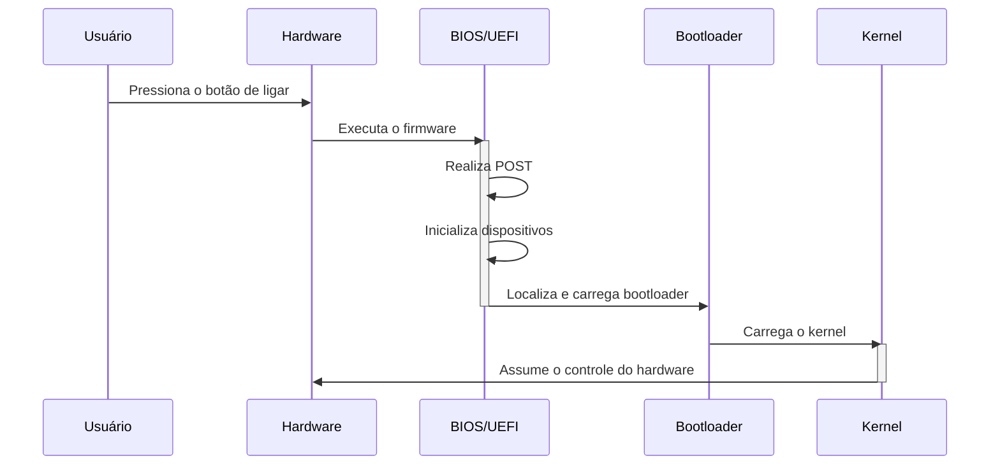
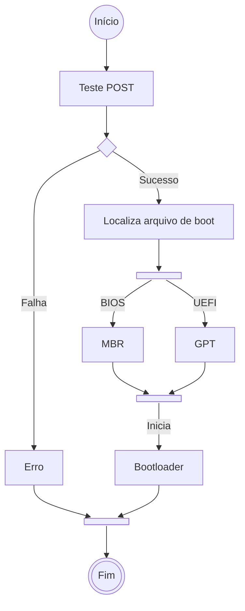

# **BIOS | UEFI**

Após finalizarmos os [Primeiros Passos](Primeiros_Passos/base-inicial.md) do nosso framework através da `base inicial`, iniciaremos agora a etapa definitiva do projeto, onde focaremos não no processo de montar um sistema operacional, mas no entendimento por trás dos componentes e conceitos de sistemas operacionais.

Sabendo disso, ao aprendermos a estrutura de um sistema operacional, não podemos nos limitar somente ao software em si, uma vez que o S.O. nada mais é do que uma forma de possibilitar o ser humano de se utilizar e comunicar com o hardware através do software. Por este motivo, passaremos pelo primeiro "componente" do sistema operacional, embora não venha do software em si, mas sim o próprio hardware através de um firmware na placa-mãe.

## **Início**

Ao ligarmos a máquina, é de grande importância que o hardware esteja preparado para inicializar o sistema operacional. Sabendo disso, as fabricantes de dispositivos utilizam firmwares específicos para essa finalidade, sendo eles: 

* `BIOS` (_Basic Input/Output System_), sendo o firmware legado de 1980 muito utilizado em máquinas mais antigas;
* `UEFI` (_Unified Extensible Firmware Interface_), a alternativa moderna para a inicialização do hardware. 

Ambos acabam tendo o mesmo objetivo prático, porém com filosofias e implementações diferentes devido as épocas em que foram desenvolvidos, visto que o UEFI contém funções nativas que o BIOS não possui, o que, apesar de aumentar sua complexidade, o torna mais confiável e eficiente para máquinas modernas, motivo esse que leva a maioria dos dispositivos já possuir o UEFI de fábrica.

Esses firmwares visam testar a integridade e inicialização do hardware através do teste `POST` (_Power-On Self-Test_), sendo este um processo de diagnóstico que ocorre logo após o computador ser ligado. Sua função principal é garantir que todos os componentes de hardware essenciais estejam funcionando corretamente antes de carregar o sistema operacional.

O BIOS/UEFI checam se todos os componentes do hardware estão prontos para iniciar. Caso algum apresente algum problema, a inicialização é interrompida junto de uma mensagem de erro -- eles não iniciam caso o hardware não esteja capacitado para ligar. 

As checagens incluem componentes como:

* SSD;
* Memória RAM;
* Periféricos essenciais. 

Por isso, não ocorrem normalmalmente desligamento ou falha em caso de, por exemplo, estar faltando mouse e teclado durante o processo. É uma etapa extremamente importante, uma vez que muitos programas cruciais estão sendo carregados quando a máquina é inicializada. Ter chips com defeito ou fonte com defeito pode afetar negativamente esse processo e levar a mais problemas.

>**Curiosidade**: No passado, a falta de teclado conectado ao dispositivo impedia o boot do sistema, gerando o erro `Keyboard not found. Press F1 to continue`, mas que foram resolvidas conforme novas opções foram sendo implementadas.

Após essa etapa, o sistema repassa para o firmware que irá localizar e carregar o `bootloader` (que será aprofundado no próximo módulo), o qual coordena o processo de inicializar o software -- no caso, o sistema operacional.

>Diagrama 1: Sequência de eventos ao ligar um dispositivo.

### **BIOS**

Após o POST, o BIOS busca a partição `MBR` (_Master Boot Record_) no disco rígido. O MBR contém informações sobre a partição ativa e o código do bootloader. O BIOS, então, transfere o controle para o bootloader, que inicia o sistema operacional.

O BIOS possui uma interface de configuração simples, geralmente baseada em texto, que é acessada através do pressionamento de uma tecla específica durante a inicialização - geralmente `F2` ou `Delete`. Isso se deve por ser um sistema bastante antigo, sendo utilizado hoje em dia praticamente em sistemas legados e hardwares com baixo desempenho técnico, uma vez que a grande parte dos hardwares modernos já estão vindo com o UEFI instalado de fábrica, afinal, é a alternativa moderna e eficiente para inicialização dos equipamentos.

>Imagem 1: Interface do BIOS

### **UEFI**

O UEFI, por sua vez, busca o bootloader em uma partição específica, a `ESP` (_EFI System Partition_), formatada em `GPT` (_GUID Partition Table_). O UEFI pode carregar múltiplos bootloaders e permite uma inicialização mais rápida e eficiente, além da possibilidade de utilizar discos rígidos maiores dos que são suportados pelo BIOS.

Diferente do BIOS, o UEFI possui uma interface um pouco mais amigável ao usuário, possuindo suporte à utilizar o mouse e proporcionando uma navegação mais intuitiva. Além disso, o firmware possui suporte nativo à tecnologia de `Secure Boot`, sendo uma especificação importante em ambientes corporativos como em servidores, por exemplo.

> **Secure Boot** é um sistema que protege a inicialização do sistema operacional, bloqueando qualquer tentativa de `boot` que não possua uma assinatura válida registrada pelos fabricantes do hardware, garantindo uma segurança a mais para a infraestrutura presente.

>Imagem 2: Interface da UEFI

## **Comparativo**

| **Recurso** | **BIOS** | **UEFI** |
| :--: | :--: | :--: |
| Suporte a Discos | Limitado a 2 TB (MBR) | Até 9.4 ZB (GPT) |
| Segurança | Sem suporte nativo para Secure Boot | Suporte nativo a Secure Boot |
| Interface | Texto simples | Interface gráfica moderna |
| Velocidade de Inicialização | Lenta | Rápida |
| Compatibilidade | Sistemas legados | Sistemas modernos e legados |

>Tabela 1: Comparativos entre as especificações dos firmwares `BIOS` e `UEFI`.

## **Sequência de Boot - Início**

Vendo todas as informações repassadas, podemos verificar que o processo inicial possui um fluxo bem simples e intuitivo, contendo componentes e processos bem definidos. A seguir, temos um fluxograma contendo as informações de uma forma mais visual a fim de consolidarmos as informações.

>Diagrama 2: Sequência de acções do `BIOS/UEFI` após o `POST`, onde localizam o arquivo de boot na partição `MBR/ESP`, respectivamente, para iniciar o `bootloader`.

## Próxima etapa

Após o teste `POST` ser concluído com sucesso, o BIOS/UEFI passa a responsabilidade para o bootloader, iniciando assim o processo de boot do sistema operacional no dispositivo. Em nosso framework, não será diferente, onde utilizaremos o `GNU GRUB` para essa tarefa. No entanto, antes de iniciarmos o trabalho, precisamos subir o nosso ambiente de desenvolvimento, uma vez que, novamente, realizar o projeto em nosso sistema principal (`host`) pode acabar afetando o seu dispositivo, exigindo novamente um isolamento da máquina.

Na próxima etapa, estaremos seguindo passo a passo o processo de se subir o nosso ambiente isolado para podermos trabalhar, iniciando assim a montagem do novo sistema principal enquanto nos aprofundamos nos conceitos de sistemas operacionais.