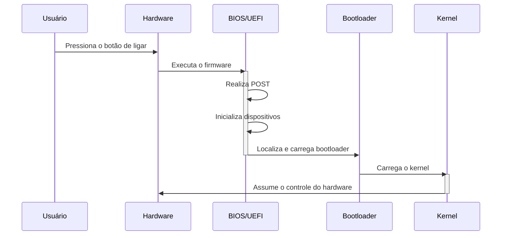
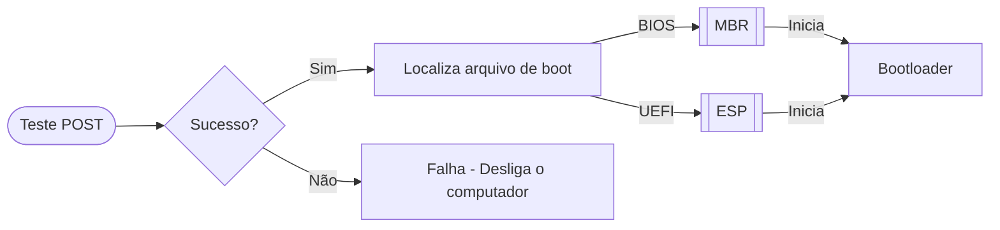

# **BIOS | UEFI**

Ao aprendermos a estrutura de um sistema operacional, não podemos nos limitar somente ao software em si, uma vez que o S.O. nada mais é do que uma forma de possibilitar o ser humano de se utilizar e comunicar com o hardware através do software. Por este motivo, passaremos pelo primeiro "componente" do sistema operacional, embora não venha do software em si, mas sim o próprio hardware através de um firmware na placa-mãe.

## **Sistema Inicial**

Ao ligarmos a máquina, o hardware precisa estar preparado para inicializar o sistema. Por isso, os dispositivos utilizam dois firmwares principais: o `BIOS` (_Basic Input/Output System_), sendo o firmware legado de 1980 muito utilizado em máquinas mais antigas, ou o `UEFI` (_Unified Extensible Firmware Interface_), a alternativa moderna para a inicialização do hardware. Ambos tendo o mesmo propósito, porém contendo tecnologias diferentes.

Esses firmwares visam, através de um teste `POST` (_Power-On Self-Test_), testar a integridade e inicialização do hardware, garantindo que este está funcionando corretamente. Após essa etapa, o sistema repassa para o firmware para localizar e carregar o `bootloader` (que será aprofundado no próximo módulo), o qual coordena o processo de inicializar o software - no caso, o sistema operacional.

>Diagrama 1: Sequência de eventos ao ligar um dispositivo.

### **BIOS**

Após o POST, o BIOS busca a partição `MBR` (_Master Boot Record_) no disco rígido. O MBR contém informações sobre a partição ativa e o código do bootloader. O BIOS, então, transfere o controle para o bootloader, que inicia o sistema operacional.

O BIOS possui uma interface de configuração simples, geralmente baseada em texto, que é acessada através do pressionamento de uma tecla específica durante a inicialização - geralmente `F2` ou `Delete`. Isso se deve pelo seu sistema ser bastante antigo, sendo utilizado hoje em dia praticamente em sistemas legados e hardwares com baixo desempenho técnico, uma vez que a maior parte dos hardwares modernos já estão vindo com o UEFI instalado de fábrica, afinal, é a alternativa moderna e eficiente para inicialização dos equipamentos.

>Imagem 1: Interface do BIOS

### **UEFI**

O UEFI, por sua vez, busca o bootloader em uma partição específica, a `ESP` (_EFI System Partition_), formatada em `GPT` (_GUID Partition Table_). O UEFI pode carregar múltiplos bootloaders e permite uma inicialização mais rápida e eficiente, além da possibilidade de utilizar discos rígidos maiores dos que são suportados pelo BIOS.

Diferente do BIOS, o UEFI possui uma interface um pouco mais amigável ao usuário, possuindo suporte à utilizar o mouse e proporcionando uma navegação mais intuitiva. Além disso, o firmware possui suporte nativo à tecnologia de `Secure Boot`, sendo uma especificação importante em ambientes corporativos como em servidores, por exemplo.

> **Secure Boot** é um sistema que protege a inicialização do sistema operacional, bloqueando qualquer tentativa de `boot` que não possua uma assinatura válida registrada pelos fabricantes do hardware, garantindo uma segurança a mais para a infraestrutura presente.

>Imagem 2: Interface da UEFI

### **Comparativo**
| **Recurso** | **BIOS** | **UEFI** |
| :--: | :--: | :--: |
| Suporte a Discos | Limitado a 2 TB (MBR) | Até 9.4 ZB (GPT) |
| Segurança | Sem suporte nativo para Secure Boot | Suporte nativo a Secure Boot |
| Interface | Texto simples | Interface gráfica moderna |
| Velocidade de Inicialização | Lenta | Rápida |
| Compatibilidade | Sistemas legados | Sistemas modernos e legados |
>Tabela 1: Comparativos entre as especificações dos firmwares `BIOS` e `UEFI`.

### **Sequência de Boot - Início**

Vendo todas as informações repassadas, podemos verificar que o processo inicial possui um fluxo bem simples e intuitivo, contendo componentes e processos bem definidos. A seguir, temos um fluxograma contendo as informações de uma forma mais visual a fim de consolidarmos as informações.

>Diagrama 2: Sequência de acções do `BIOS/UEFI` após o `POST`, onde localizam o arquivo de boot na partição `MBR/ESP`, respectivamente, para iniciar o `bootloader`.

Tanto o BIOS quanto o UEFI visam garantir que o hardware está funcionando corretamente antes de iniciar o sistema operacional, o que muda é a forma que fazem isso, uma vez que o UEFI possui tecnologias e sistemas que o BIOS não possui, o que, apesar de aumentar sua complexidade, o torna mais confiável e eficiente para máquinas modernas, cujo a maioria já possui o UEFI de fábrica.

O BIOS e UEFI checam se todos os componentes do hardware estão prontos para iniciar. Caso algum apresente algum problema, a inicialização é interrompida junto de uma mensagem de erro -- eles não iniciam caso o hardware não esteja capacitado para ligar. As checagens incluem componentes como SSD, memória RAM e periféricos essenciais, não ocorrendo desligamento ou falha em caso de, por exemplo, estar faltando mouse e teclado durante o processo. É uma etapa extremamente importante, uma vez que muitos programas cruciais estão sendo carregados quando a máquina é inicializada. Ter chips com defeito ou fonte com defeito pode afetar negativamente esse processo e levar a mais problemas.

