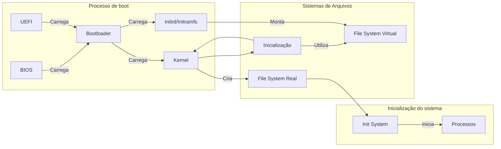

# **Ambiente - LecOS**

Após a inicialização correta do hardware, a responsabilidade da inicialização passa a ser do software daqui pra frente, uma vez que agora ele tem a liberdade de poder executar devido aos componentes da máquina estarem funcionando corretamente. O responsável pela próxima etapa é o `bootloader`, no entanto, antes de iniciarmos de fato o tutorial, precisamos subir nosso ambiente de desenvolvimento primeiro, dessa vez utilizando uma nova distribuição, mais completa e de propósito geral, como base para repassarmos nos conceitos fundamentais da disciplina enquanto realizamos na prática.

---

## **Componentes**

Por se tratar de um sistema mais completo visando uma melhor didática, teremos alguns componentes a mais na composição, diferenciando da utilização do `BusyBox` na etapa anterior, onde sozinho ele substituia boa parte dos componentes necessários para se utilizar um sistema operacional. Os componentes que utilizaremos são:

* Kernel Linux (64-bit);
* GNU Coreutils;
* Bash;
* Glibc;
* Nano;
* Ncurses;
* Util-Linux;
* GNU GRUB (bootloader).

>Todos os componentes do projeto serão detalhados em suas respectivas etapas.

Como mencionado anteriormente, o processo consistirá em passar por cada etapa do processo do sistema operacional, desde a etapa de `ligar` o computador até o início de seus processos, visando o entendimento de forma prática dos conceitos e sistemas, ao invés de simplesmente entender como montar um sistema operacional uma segunda vez.

O conteúdo abordado, por ser um pouco mais extenso, será dividido em etapas que englobam as diferentes componentes e conceitos, totalizando 4 módulos presentes no processo com 11 etapas ao todo, sendo eles:

* **Módulo 1 - Início**;
  * Iniciando o Ambiente;
  * BIOS/UEFI.
  * Bootloader;
* **Módulo 2 - Boot**;
  * Kernel;
  * Memória (primária e secundária).
  * Inicialização;
* **Módulo 3 - Processos**;
  * Userland;
  * Init System;
  * Processos.
* **Módulo 4 - Final**.
  * Entrada/Saída;
  * Interface gráfica.

---

## **Ambiente**

Assim como na etapa inicial, o trabalho será desenvolvido também dentro de um container `Docker`, visando novamente uma segurança maior para evitar problemas no sistema principal. No entanto, em vez de iniciarmos tudo manualmente através de comandos simples, contaremos com um script de inicialização completo do ambiente, visando um desenvolvimento mais dinâmico e direto ao ponto uma vez que já passamos pelo conceito e processo de compilação nos primeiros passos, garantindo uma boa reprodutibilidade.

<div align="center">


</div>

>Imagem 1: Mensagem de boas-vindas ao executar o script de construção do ambiente.

Além disso, nesse ambiente possuímos persistência de dados graças ao volume construído junto do container, ou seja, você pode pausar o processo e retornar quando quiser, não sendo necessário fazer tudo de uma só vez, evitando perda de progresso e permitindo seguir no próprio ritmo.

>Ao desligar o computador, o container será parado, mas o seu progresso permanece salvo no volume criado. Para retornar ao ambiente, execute `docker restart LecOS-dev` e, para entrar novamente, `docker exec -it LecOS-dev bash`.

<div align="center">


</div>

>Imagem 2: "Take a break" - Faça uma pausa. O sistema permite que pare quando quiser, podendo retornar de onde parou quando quiser.

---

## **Fluxo**

Com nosso objetivo bem definido, não ficaremos presos somente nos componentes que iremos montar, mas também repassaremos em conceitos fundamentais dos sistemas operacionais, o que também inclui o hardware que executa o sistema. Com isso, seguindo todas as etapas presentes, temos o seguinte fluxo:


>Diagrama 1: Fluxo de inicialização de uma máquina, iniciando pelo `BIOS/UEFI` e finalizando na inicialização dos processos.

---

## **Inicialização do ambiente**

Para iniciarmos o nosso trabalho, precisamos criar o nosso ambiente de desenvolvimento. Para isso, estaremos utilizando o script mencionado para isso, o `init.sh`. Esse script contém os comandos necessários para a inicialização do container onde seguiremos o framework, automatizando o processo de criação e já fornecendo todas as ferramentas que precisaremos para realizar essa tarefa.

Para executarmos o script, precisamos primeiramente fornecer a permissão de execução para que ele possa ser executado, uma vez que mesmo o script sendo criado, ele não possui por padrão a capacidade de rodar os comandos sem permissão. Portanto, acessando o diretório [Sistema Principal](Sistema_Principal), inserimos o seguinte comando:

```bash
# Acessa o diretório 'Sistema_Principal'
cd Sistema_Principal

# Fornece a permissão de execução (+x) para o script 'init.sh'
chmod +x init.sh
```

Esse comando, basicamente, torna o script `init.sh` executável para o nosso sistema, possibilitando subir todo o ambiente com apenas essa instrução, deixando o _setup_ do ambiente mais prático e rápido - não estamos aprendendo a subir o ambiente novamente (visto que já fizemos isso na base inicial), mas sim a entender os conceitos de sistemas operacionais enquanto montamos um neste ambiente.

Após fornecer a permissão ao script, podemos enfim iniciar nosso trabalho. Ainda dentro do diretório `Sistema_Principal`, executaremos:

```bash
./init.sh
```

Esse script nada mais é que uma sequência de comandos de terminal que são executados automaticamente. Ao executá-lo, ele roda os comandos necessários que foram configurados para deixar nosso ambiente de trabalho pronto para utilização. Abaixo seguem exemplos dos comandos.

>**ATENÇÃO**: Não é necessário executar os comandos abaixo, pois o script já irá realizar a tarefa automaticamente, estando presente somente para curiosidade.

```bash
# Cria um volume para persistência de dados
# (Pode pausar quando necessário sem perder o progresso)
docker volume create lecos_data

# Cria o container de trabalho "LecOS-dev"
# Utiliza a imagem "lecos" criada para este propósito
docker run -d --name LecOS-dev --privileged -v lecos_data:/LOS/root felpzzex/lecos:latest tail -f /dev/null
```

Por fim, o script também copia arquivos essenciais para dentro do nosso ambiente, como o `kernel Linux` já previamente compilado, o arquivo de inicialização do sistema e os scripts de build para cada componente da nossa userland, apresentados na sessão `Componentes`. Caso esteja interessado, pode verificar o conteúdo completo presente no script acessando o arquivo [init.sh](../init.sh).

<div align="center">


</div>

>Imagem 3: Conteúdo copiado do sistema principal para dentro do container, contendo todos os scripts de build dos componentes.

Após a execução do script, ele te jogará dentro do container de desenvolvimento do framework, onde iremos montar a distribuição mínima enquanto nos aprofundamos nos conceitos fundamentais de um S.O. As próximas etapas passarão por cada componente presente em nosso planejamento de forma aprofundada e dedicada, visando uma "ordem cronológica" do processo de inicialização, onde já abordamos o início com o `BIOS e UEFI`, na próxima etapa, começaremos pelo [bootloader](2-Bootloader.md).