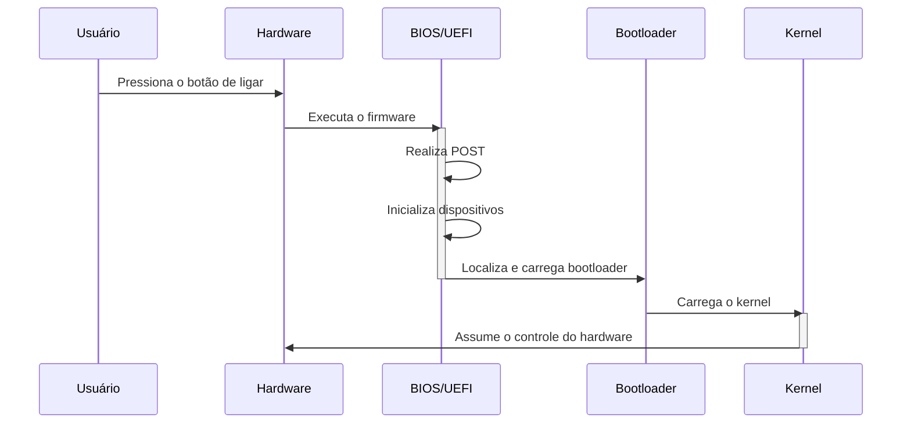
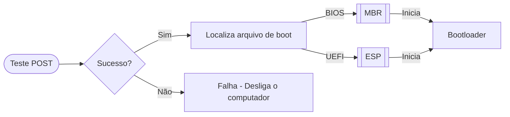

# **BIOS | UEFI**

Ao aprendermos a estrutura de um sistema operacional, não podemos nos limitar somente ao software em si, uma vez que o S.O. nada mais é do que uma forma de possibilitar o ser humano de se utilizar e comunicar com o hardware através do software. Por este motivo, passaremos pelo primeiro "componente" do sistema operacional, embora não venha do software em si, mas sim o próprio hardware.

Esse processo visa, através de um teste `POST` (_Power-On Self-Test_), testar a integridade e inicialização do hardware, garantindo que este está funcionando corretamente. Após essa etapa, o sistema repassa para o firmware localiza e carrega o `bootloader` (que será aprofundado na próxima etapa), o qual coordena o processo de inicializar o software - no caso, o sistema operacional.

Os equipamentos, geralmente, utilizam dois firmwares principais: o `BIOS` (_Basic Input/Output System_), sendo o firmware legado de 1980 muito utilizado antigamente, e a `UEFI` (_Unified Extensible Firmware Interface_), a alternativa moderna para a inicialização do hardware. Ambos tendo o mesmo propósito (garantir que o hardware está funcionando corretamente antes de iniciar o sistema operacional), porém utilizando abordagens diferentes, sendo a UEFI desenvolvida para "corrigir" as limitações do BIOS, sendo a principal razão dos equipamentos modernos optarem por implementar a UEFI.

>Diagrama 1: Sequência de eventos ao ligar um dispositivo.

### **BIOS**

Após o POST, o BIOS busca o `MBR` (_Master Boot Record_) no disco rígido. O MBR contém informações sobre a partição ativa e o código do bootloader. O BIOS, então, transfere o controle para o bootloader, que inicia o sistema operacional.

O BIOS possui uma interface de configuração simples, geralmente baseada em texto, que é acessada através do pressionamento de uma tecla específica durante a inicialização - geralmente `F2` ou `Delete`.

### **UEFI**

O UEFI, por sua vez, busca o bootloader em uma partição específica, a `ESP` (_EFI System Partition_), formatada em `GPT` (_GUID Partition Table_). O UEFI pode carregar múltiplos bootloaders e permite uma inicialização mais rápida e eficiente, além da possibilidade de utilizar discos rígidos maiores dos que são suportados pelo BIOS.

Diferente do BIOS, o UEFI possui uma interface um pouco mais amigável ao usuário, possuindo suporte à utilizar o mouse e proporcionando uma navegação mais intuitiva. Além disso, o firmware possui suporte nativo à tecnologia de `Secure Boot`, sendo uma especificação importante em ambientes corporativos como em servidores, por exemplo.

> **Secure Boot** é um sistema que protege a inicialização do sistema operacional, bloqueando qualquer tentativa de `boot` que não possua uma assinatura válida registrada pelos fabricantes do hardware, garantindo uma segurança a mais para a infraestrutura presente.

### **Comparativo**
| **Recurso** | **BIOS** | **UEFI** |
| :--: | :--: | :--: |
| Suporte a Discos | Limitado a 2 TB (MBR) | Suporta discos maiores que 2 TB (ESP) |
| Segurança | Sem suporte nativo para Secure Boot | Suporte nativo a Secure Boot |
| Interface | Texto simples | Interface gráfica moderna |
| Velocidade de Inicialização | Lenta | Rápida |
| Compatibilidade | Sistemas legados | Sistemas modernos e legados |
>Tabela 1: Comparativos entre as especificações dos firmwares `BIOS` e `UEFI`.

### **Sequência de Boot - Início**

Vendo todas as informações repassadas, podemos verificar que o processo inicial possui um fluxo bem simples e intuitivo, contendo componentes e processos bem definidos. A seguir, temos um fluxograma contendo as informações de uma forma mais visual a fim de consolidarmos as informações.

>Diagrama 2: Sequência de acções do `BIOS/UEFI` após o `POST`, onde localizam o arquivo de boot na partição `MBR/ESP`, respectivamente, para iniciar o `bootloader`.

### **Finalidade**

