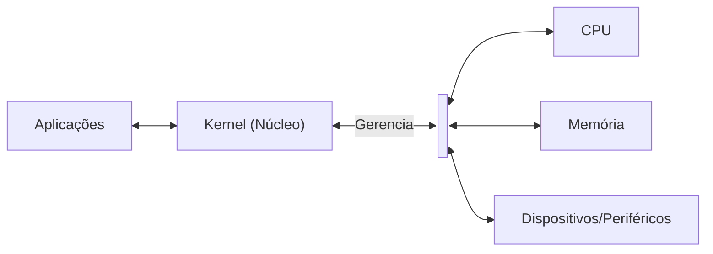
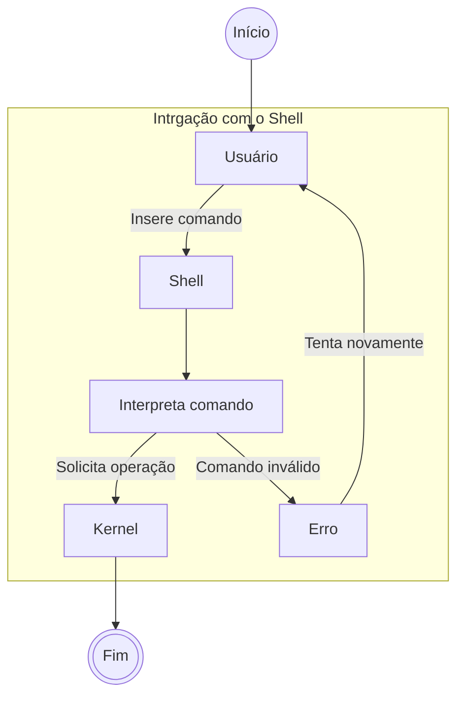

# **Kernel**

Tendo finalizado o primeiro módulo do nosso framework, chegamos na parte de inicializar de fato o nosso sistrma. Para isso, tendo o nosso `bootloader` funcional, estaremos iniciando o próximo passo do processo, sendo este a implementação do kernel Linux em nossa imagem bootável, uma vez que, mesmo com o bootloader operando corretamente, ele não tem um kernel para carregar, encerrando o processo de inicialização antes mesmo de começar.

<div align="center">


</div>

>Imagem 1: Erro do GRUB por não localizar o kernel na pasta indicada.

## **Componente Utilizado**

- Kernel Linux 64-bits

O kernel (núcleo) é um dos principais componentes de um Sistema Operacional (S.O.), sendo o componente responsável por interligar o hardware do dispositivo (computador, celular...) com os softwares executados no mesmo, gerenciando os recursos essenciais como a CPU, memória e dispositivos conectados. Para realizar essa tarefa, o kernel gerencia as solicitações desses programas para decidir qual processo terá o acesso aos recursos computacionais em determinado momento, garantindo a estabilidade do sistema como um todo e impedindo que outro programa possa interferir na execução de outro ou mesmo no próprio hardware.

Todo S.O. possui um kernel em sua composição, independente se ele é projetado para computadores pessoais, celulares, sistemas embarcados (Alexa, SmartTVs...), todos necessitam do núcleo presente, ou a sua utilização se tornaria muito mais complexa e nem um pouco prática, uma vez que seria necessário escrever códigos personalizados para interação entre o software e hardware.

Nesta etapa, estaremos conferindo o que é o kernel com mais detalhes e suas finalidades em um S.O., ao mesmo tempo em que iremos inserí-lo em nossa distribuição minimalista para continuarmos o processo de construção.

> Nessa etapa, para fins didáticos, o `kernel Linux` já foi previamente compilado e disponibilizado no repositório no diretório `Componentes_Principais` com o nome `bzImage`, evitando o tempo de compilação que já passamos anteriormente na Base Inicial e permitindo focarmos na didática do framework.

## **Sobre o Kernel**

Como mencionado anteriormente, o kernel de um S.O. é o cérebro do sistema, é o responsável por facilitar a comunicação entre o hardware e o software do dispositivo, sendo uma de suas principais tarefas a de gerenciar os recursos da máquina, como:

* **Gerenciamento de recursos**: controla e distribui o uso do processador, tempo, arquivos e outros recursos do sistema entre todos os programas em execução. Garante que eles compartilhem o computador de forma eficiente.
* **Gerenciamento de memória**: aloca e protege a memória RAM usada pelos programas. Evita que um programa acesse ou corrompa a memória de outro, garantindo a estabilidade do sistema.
* **Gerenciamento de dispositivos**: permite que os programas interajam com o hardware do computador (disco, teclado, rede). Usa drivers para se comunicar com os dispositivos e gerenciar seu acesso.



> Diagrama 1: Recursos que o kernel gerencia para forcecer às aplicações do sistema.

## **Como funciona o kernel?**

Para executar suas funções corretamente, o kernel possui dois modos de atuação, o `modo usuário` e o `modo núcleo`:

* **Modo usuário**: É o modo em que os programas aplicativos executam, sendo conhecido como modo menos privilegiado ou modo restrito por possuir um acesso limitado ao hardware nesse modo. Quando o processo em modo usuário requer qualquer recurso de hardware, a solicitação é enviada ao kernel. No modo usuário, os processos tem seu próprio espaço de endereço e não podem acessar o espaço que pertence ao kernel. Com isso, se houver uma falha, ela não afeta o sistema como um todo, somente o processo em específico.
* **Modo núcleo**: O modo kernel é reservado para funções de baixo nível do sistema operacional. As solicitações de recursos computacionais pelos programas aplicativos são enviadas por meio de chamadas do sistema. Em seguida, o computador entra no modo kernel no modo usuário. Quando a tarefa é concluída, o modo volta ao modo de usuário do modo kernel. Essa transição é conhecida como "mudança de contexto”. O modo kernel também é chamado como modo de sistema ou modo privilegiado. Não é possível executar todos os processos no modo kernel porque, se um processo falhar, todo o sistema operacional poderá falhar.

## **Principais tipos de kernel**

Apesar de ter uma função específica em um sistema, o kernel possui diversas variações de sua implementação, cada uma possuindo seus pontos fortes e fracos, variando bastante na sua complexidade. Dentes estes, podemos citar as principais variantes, sendo elas:

* Kernel monolítico
* Microkernel
* Kernel híbrido

<div align="center">


</div>

> Imagem 2: Diagrama com as diferentes arquiteturas de kernel.

Todos seguem o mesmo propósito que um kernel possui em um sistema operacional, porém implementados de forma diferente, visando abordagens que sirvam para determinados casos de forma mais eficiente. Abaixo, estaremos indo mais a fundo nestes tipos e suas particularidades.

### **Kernel monolítico**

O **kernel monolítico**, como o próprio nome sugere, possui uma arquitetura de "monolito", onde as principais funcionalidades, como neste caso são o gerenciamento de processos, gerenciamento de memória e controle de dispositivos, estão implementadas em um único bloco de código executável.

Todos os serviços do sistema operacional, incluindo drivers de hardware e sistemas de arquivos, operam em modo kernel, o que significa que têm acesso total ao hardware. Isso permite uma execução mais rápida e uma resposta mais eficiente às solicitações do usuário.

Como exemplos que seguem esta arquitetura, temos o kernel dos sistemas **BSD** e, sendo a base do nosso framework, o `kernel Linux`, onde foi construído e expandido através da arquitetura monolítica. Graças a isso, a execução se torna bem mais rápida e eficiente, uma vez que tudo está unido em um único bloco em vez de estarem em componentes separados, no entanto, isso acaba por tornar sua expansão e manutenção mais complexos ao longo do tempo, uma vez que o projeto pode acabar crescendo e passando por vários desenvolvedores.

<div align="center">


</div>

> Imagem 3: **BSD** e **Linux**, exemplos da arquitetura monolítica.

### **Microkernel**

O **microkernel**, por sua vez, possui uma arquitetura na qual a maioria das funções é executada fora do núcleo central, ao contrário de um kernel monolítico, cujo aplicações essenciais se concentram dentro de um único núcleo com amplos privilégios. Os microkernels adotam uma abordagem minimalista, onde apenas funções básicas são mantidas no núcleo central.

Essa abordagem diferencia da arquitetura monolítica, uma vez que ela traz uma segurança maior, uma vez que, mesmo que ocorra um problema em alguma parte do sistema, este não irá sofrer de forma geral, uma vez que os componentes defeituosos não estarão diretamente interligados aos que ainda estão funcionando, facilitando a expansão do projeto como também a correção de bugs.

Um bom exemplo de sistema que utiliza um microkernel é o MINIX, um sistema operacional baseado em microkernel utilizado no firmware Intel ME 11. Ele é um sistema, de fato, robusto e confiável, porém, devido às inúmeras requisições que o núcleo principal precisa realizar, seu desempenho tende a ser mais lento do que comparado à abordagem monolítica, onde todos os componentes existem em um mesmo espaço.

<div align="center">


</div>

> Imagem 4: **MINIX**, exemplo da arquitetura de microkernel.

### **Kernel híbrido**

O **kernel híbrido** é uma arquitetura que combina características de kernels monolíticos e microkernels. Essa abordagem permite que o sistema operacional mantenha a eficiência e a performance de um kernel monolítico, enquanto se beneficia da modularidade e da flexibilidade de um microkernel.

Uma das principais características é a capacidade de executar código em espaço de usuário e espaço de kernel, permitindo que partes do sistema operacional possam ser executadas fora do núcleo, permitindo que os desenvolvedores criem módulos que podem ser carregados e descarregados conforme necessário, garantindo uma maior eficiência no uso de recursos, melhor desempenho em tarefas críticas e a capacidade de suportar uma variedade de hardware.

Apesar das suas vantagens, o kernel Híbrido também enfrenta desafios. A complexidade da sua arquitetura pode levar a dificuldades na depuração e na manutenção, além da necessidade de equilibrar a modularidade com a performance pode resultar em trade-offs que nem sempre são fáceis de gerenciar.

Alguns dos sistemas operacionais mais conhecidos que utilizam a arquitetura incluem o **Windows NT** e o **macOS**. Cada um implementa o conceito de kernel híbrido de maneira única, mas compartilham a ideia de combinar a eficiência de um kernel monolítico com a flexibilidade de um microkernel.

<div align="center">


</div>

> Imagem 5: **Windows NT** e **MacOS**, exemplos de sistemas operacionais que utilizam a arquitetura de kernel híbrido.

## **Kernel x Shell**

No entanto, o kernel, por si só, não é responsável por fornecer uma interface de interação direta com o usuário. Para isso, contamos com programas de espaço de usuário, entre eles o **shell**. O shell é um interpretador de comandos que permite ao usuário interagir com o sistema por meio de uma interface textual, recebendo os comandos, interpretando-os e solicitando ao sistema operacional a execução das operações correspondentes.

É importante destacar que **shell e terminal não são a mesma coisa**. O terminal é o ambiente que permite a entrada e a saída de texto, enquanto o shell é o programa responsável por interpretar os comandos inseridos pelo usuário. Exemplos de shells são o `Bash`, `Zsh` e `Fish`.

De forma simplificada, podemos representar essa interação da seguinte maneira: **Usuário digita um comando → Terminal → Shell interpreta → Solicita operações ao sistema → Kernel**



> Diagrama 2: Fluxo simplificado de interação entre o usuário, o terminal, o shell e o kernel.


## **O kernel Linux**

O kernel Linux surgiu como um projeto pessoal de um jovem estudante, Linus Torvalds, que desejava criar um sistema semelhante ao Unix para utilizar em seu computador. O que começou como um projeto pessoal acabou tomando um rumo além do imaginado, formando uma grande comunidade em torno do projeto, que passou a ajudar em seu desenvolvimento e expansão.

O kernel Linux é utilizado por milhões de pessoas em todo o mundo. Devido à sua natureza livre e de código aberto, diferentes comunidades e empresas podem utilizá-lo e desenvolver seus próprios projetos a partir dele, dando origem às famosas distribuições Linux que conhecemos hoje. Podemos citar o Debian, uma das distribuições mais antigas ainda em atividade, o Fedora, uma distribuição voltada para inovação tecnológica e patrocinada pela Red Hat, e o Arch Linux, que oferece uma abordagem minimalista e bastante controle ao usuário sobre a configuração do sistema, contando também com uma extensa documentação mantida pela comunidade.

Atualmente, o projeto continua sendo liderado por Linus Torvalds e está em constante desenvolvimento e expansão. O kernel Linux está presente em uma grande parte da infraestrutura moderna, sendo utilizado em servidores, dispositivos móveis, sistemas embarcados e diversos outros equipamentos. Sua flexibilidade, estabilidade e possibilidade de personalização fizeram com que se tornasse uma das principais bases da computação moderna.
## **Inserindo em nosso sistema**

Retornando ao nosso framework, precisamos inserir o kernel Linux em nosso sistema para que este possa coordenar os processos e recursos computacionais necessários para o funcionamento. Para isso, não estaremos compilando novamente como na `Base Inicial`, uma vez que já temos o binário pré-compilado em nosso repositório como mencionado anteriormente. Dessa forma, podemos nos concentrar na montagem do sistema em vez de repetir os processos inúmeras vezes.

<div aling="center">


</div>

> Imagem 6: Diretório **Componentes_Principais** contendo o binário **bzImage**, nosso kernel Linux pré-compilado.

Com o binário localizado, é hora de inserí-lo em nossa estrutura de diretórios para que possamos gerar o arquivo de boot e inicializar o sistema. Para isso, abrindo o diretório `framework_LecOS` no terminal, utilizaremos os seguintes comandos:

```bash
# Garantir que estamos no diretório correto
cd Sistema_Principal/Componentes_Principais

# Estando dentro dele, inserimos o comando a seguir
docker cp bzImage LecOS-dev:/LOS/root/boot
```

Basicamente, o comando `docker cp [ITEM] [NOME-CONTAINER]:/CAMINHO` copia determinado arquivo que queremos em nosso sistema principal para o diretório no caminho que especificarmos dentro do contêiner. Com isso, nós apenas copiamos o binário presente para `/root/boot` dentro de nosso ambiente de desenvolvimento, sendo este diretório onde o kernel Linux deve estar para que o bootloader `GNU GRUB` o localize e possa carregá-lo durante o boot inicial.

<div align="center">


</div>

> Imagem 7: Comando sendo executado para copiar o binário do kernel Linux para dentro do contêiner.

<div align="center">


</div>

> Imagem 8: Binário presente no ambiente de desenvolvimento após a execução do comando.

Com isso, já temos o que é necessário para inserir o kernel em nossa imagem e, após, gerá-la novamente. Para isso, repetiremos o processo que vimos na etapa anterior, onde criamos a imagem bootável e instalamos o **GNU GRUB** nela. Aqui, estaremos apenas inserindo o kernel Linux, permitindo que apenas montemos a imagem novamente. Abaixo, os comandos necessários para isso:

```bash
# Montamos novamente a imagem em /mnt
mount /dev/mapper/loop0p1 /mnt

#Inserimos o kernel em /mnt/boot
cp root/boot/bzImage /mnt/boot 
```

> **NOTA**: Se uma pausa foi efetuada e o computador foi desligado ou o contêiner foi reiniciado, as configurações podem ter sido perdidas. Para resolver, basta executar os seguintes comandos, na ordem indicada:
> ```bash
> # Comandos utilizados na etapa 2 - Bootloader
> mknod /dev/loop0 b 7 0
> losetup -fP --show lecos.img
> kpartx -av /dev/loop0
> mount /dev/mapper/loop0p1 /mnt
>
> # Inserindo o kernel em /mnt/boot
> cp root/boot/bzImage /mnt/boot 
> ```

Com isso, temos enfim nosso kernel inserido no sistema, permitindo que o bootloader (GRUB) o localize e carregue-o, tornando possível a primeira etapa da inicialização.

<div align="center">


</div>

> Imagem 9: Binário do kernel Linux presente na imagem bootável, montada no diretório `/mnt`.

## **Segundo boot**

Após estarmos com tudo montado, é hora de realizarmos o segundo boot, dessa vez contendo o kernel em nossa imagem. Para isso, desmontaremos `lecos.img` do diretório `/mnt` e copiaremos a imagem para o nosso host.

> **Host**: Sistema que você utiliza em sua máquina, o principal.

```bash
# Desmontar o arquivo do diretório /mnt
umount /mnt
```
Com a imagem desmontada, abra outro terminal fora do contêiner docker, de modo a acessarmos e utilizarmos nosso sistema principal. Com isso, rode os seguinte comando:

```bash
# Copia 'lecos.img' para o sistema host novamente
docker cp [CONTAINER ID]:/LOS/lecos.img .
```

Pode levar um tempo novamente devido ao tamanho da imagem, mas após a execução, teremos nossa imagem atualizada contendo o kernel Linux presente em sua composição. Para testar, estaremos utilizando a ferramenta `QEMU` novamente, onde, dentro do mesmo diretório onde `lecos.img` foi copiada, rodaremos o programa com o comando a seguir:

```bash
# Utilizamos o QEMU para bootar a imagem mais uma vez
qemu-system-x86_64 lecos.img
```

Executando a nossa imagem, nos depararemos com a mesma tela de seleção que vimos anteriormente, contudo, diferente da etapa passada, nesta o boot não para por aí. Por termos o kernel presente, o **GRUB** consegue encontrar o binário e reconhecer o mesmo, iniciando o carregamento. No entanto, o kernel sozinho não consegue fazer nada, uma vez que ainda não possuímos o arquivo de inicialização do sistema, representado pela mensagem `No working init found`.

<div align="center">


</div>

> Imagem 10: Kernel panic causado pela falta de um arquivo de inicialização.

Contudo, isso nos fornece a estrutura ideal para, de fato, montarmos o nosso sistema: nosso **bootloader** e o **kernel Linux** funcionando corretamente no ambiente, restando apenas o arquivo de inicialização, que nada mais é que o primeiro processo executado pelo kernel no espaço de usuário (userspace). Sua função é dar continuidade ao processo de inicialização, preparando o ambiente e iniciando os demais processos e serviços necessários para o funcionamento do sistema operacional.

## **Próximos passos**

Finalizamos aqui uma das principais etapas do sistema, a integração do kernel à imagem. Na próxima etapa, estaremos repassando pelos conceitos de `memória primária` e `memória secundária` antes de, de fato, inicializar o sistema, pois ambas desempenham um papel importante dentro de um Sistema Operacional. Um excelente trabalho até aqui, estamos caminhando bem, nos vemos no próximo passo!