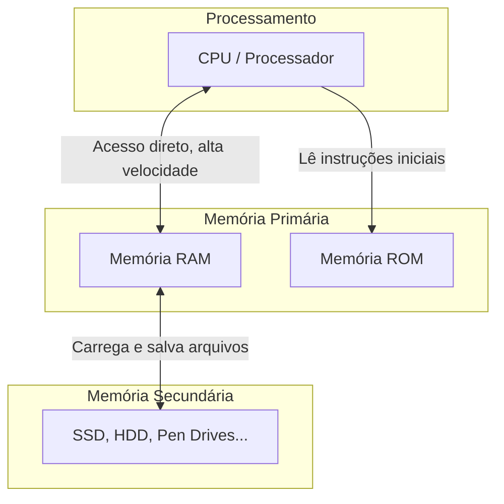

# **Memória Primária e Secundária**

Avançando nos conceitos, estamos nos aproximando da inicialização real do nosso sistema. No entanto, antes de prosseguirmos no processo, devemos revisar um conceito importante que está diretamente ligado no boot do sistema: a memória `primária` e `secundária`. Estaremos entendendo nessa etapa para, enfim, iniciarmos o nosso sistema.

## **Conceito de memória**

Enquanto o processador (CPU) atua como o "cérebro" do computador (realizando os cálculos e tomando decisões), a memória atua como a sua mesa de trabalho e o seu arquivo de documentos. Ela é o componente físico capaz de armazenar dados, instruções e programas, seja de forma temporária ou permanente.

A memória é fundamental para o funcionamento de qualquer dispositivo e é dividida em duas categorias principais: primária e secundária. A memória primária é aquela com a qual o processador se comunica diretamente (a mesa de trabalho), enquanto a memória secundária é o armazenamento de longo prazo (o arquivo). Embora ambas armazenem dados, elas possuem diferenças cruciais em velocidade, capacidade e volatilidade.

Para ilustrar como esses componentes interagem, veja o diagrama abaixo:



> Diagrama 1: Interações existentes entre os tipos de memória.

## **Principais tipos**

### **1. Memória primária**

A memória primária, também conhecida como memória principal, é a área do computador que armazena os dados e informações que estão sendo usados neste exato momento.

Composta por chips semicondutores de altíssima velocidade, ela permite que o processador acesse as informações quase instantaneamente. O principal exemplo é a Memória RAM (Memória de Acesso Aleatório).

Características principais:

  * **Volatilidade**: A `RAM` é volátil. Isso significa que ela precisa de energia elétrica constante para manter os dados. Se a energia acabar ou o computador for desligado, tudo o que estiver na RAM será perdido (é por isso que perdemos um texto não salvo quando a luz cai).
  * **Função**: Todo aplicativo aberto no computador (seu navegador, este texto, o próprio sistema operacional) é copiado do armazenamento secundário e carregado na RAM para que o computador funcione de forma fluida.
  * **Nota de exceção**: Existe um tipo de memória primária chamada `ROM` (Memória Somente de Leitura) que não perde seus dados sem energia. Ela guarda instruções básicas de fábrica, essenciais para ligar a máquina.

### **2. Memória secundária**

A memória secundária é o armazenamento externo ou de longo prazo do computador. Ela atua como uma "biblioteca" ou "arquivo", guardando tudo aquilo que você deseja manter salvo para o futuro.

Características principais:

  * **Não volátil**: Os dados permanecem intactos, mesmo que o computador seja desligado ou desconectado da tomada.
  * **Processamento Indireto**: A CPU não processa os dados diretamente daqui. Se você quiser abrir um filme que está na memória secundária, o sistema primeiro o copia para a memória primária (RAM), e só então a CPU o processa para exibi-lo na tela.
  * **Capacidade vs. Velocidade**: É muito mais lenta que a memória primária, mas compensa oferecendo capacidades de armazenamento gigantescas (de Gigabytes a Terabytes) por um custo muito menor.

* **Exemplos**: SSDs, discos rígidos (HDDs), pen drives e cartões de memória.

<div align="center">


</div>

> Imagem 1: Componentes responsáveis pelas memórias primária (RAM) e secunrária (HDD/SSD).

## **Papel no boot**

O boot (ou inicialização) é o processo que ocorre desde o momento em que você aperta o botão de ligar até o momento em que a área de trabalho do sistema operacional aparece na tela. Neste processo, o trabalho em equipe das memórias é vital.

O passo a passo ocorre da seguinte maneira:

1. **O Despertar (ROM)**: Quando o computador é ligado, a memória RAM está completamente vazia e a CPU não sabe o que fazer. O processador então busca as primeiras instruções na memória ROM (especificamente, na `BIOS/UEFI`).
2. **Checagem de Hardware (POST)**: A **BIOS/UEFI** realiza um teste rápido para garantir que o teclado, o mouse, a própria memória RAM e outros hardwares básicos estão funcionando perfeitamente.
3. **Buscando o Sistema**: Após os testes, a BIOS procura o sistema operacional que está "dormindo" guardado na Memória Secundária (no SSD ou HDD).
4. **Carregamento (Passagem de bastão)**: Os arquivos principais do sistema operacional são lidos da Memória Secundária e copiados para a Memória Primária (RAM).
5. **Pronto para Uso**: Agora que o sistema operacional está carregado na RAM, o processador pode acessá-lo rapidamente. O computador conclui a inicialização e fica pronto para receber seus comandos.

## **Visualização prática**

Embora o nosso sistema ainda não possua um arquivo de inicialização, podemos estar experimentando a interação entre memória primária e secundária criando arquivos simples que permitirão essa visualização na prática. Para isso, nós iremos estar gerando um `initramfs` básico, que nada mais é que um arquivo que carrega um sistema de arquivos temporário na **memória RAM**, fazendo com que, após desligar o sistema, o progresso interno seja perdido por tudo ser carregado diretamente na RAM.

O único propósito de um initramfs é o de montar o sistema de arquivos raiz, sendo um conjunto completo de diretórios que você encontraria em um sistema de arquivos raiz normal.

> **Nota**: Esse é o mesmo funcionamento da nossa **Base Inicial** onde, se por acaso sairmos e entrarmos no sistema novamente, tudo que fizemos lá dentro é perdido, uma vez que ele só utiliza um **initramfs** simples para carregar um **shell**.

### **Criando o PID 1**

Para a inicialização de um sistema, ele precisa de um processo inicial, o `PID 1`. Como vimos na Base Inicial, este processo é o que inicia e mantém o sistema operacional funcionando de forma contínua, sem ele, entramos no já conhecido `kernel panic`, onde simplesmente deixa de funcionar por conta do PID 1 não existir no sistema.

Para criar o **initramfs**, precisaremos preparar o ambiente, necessitando somente de dois componentes iniciais para nos permitir interagir e testar, sendo eles:

* **Bash**, o shell básico do sistema
* **Glibc**, biblioteca C padrão

Esses serão os componentes mínimos que precisaremos para interagir com o sistema, de forma a verificar a volatilidade da memória RAM ao realizarmos alterações no sistema em si e, após isso, reiniciarmos o mesmo. Tendo isso em mente, precisaremos baixar e compilar os pacotes necessários.

> **NOTA**: Para fins de reprodutibilidade, estaremos usando versões fixas e estáveis dos componentes, tendo como base a distribuição `Debian`.

<div align="center">


</div>

> Imagem 2: **GNU Bash** e **GNU C Library**, componentes utilizados nessa etapa.

### **GNU Bash**

O `Bash` é o shell padrão de diversas distribuições GNU/Linux (como `Debian`, `Fedora`, etc...), sendo o componente básico para permitir a interação do usuário com o sistema operacional através de comandos. Com isso em mente, iremos baixar através do comando `wget`.

> **Wget**: Ferramenta de linha de comando que permite o download de arquivos utilizando protocolos **HTTP**, **HTTPS**, **FTP** e **FTPS**, permitindo baixar arquivos em ambientes minimalistas sem a necessidade de utilizar um navegador. Também faz parte do projeto **GNU**.

A sintaxe base do **Wget** consiste no comando seguido do link do conteúdo a ser baixado. No caso do GNU Bash, temos no próprio site do Projeto GNU, onde podemos conseguir simplesmente copiando o link do arquivo na página de downloads e versões.

<div align="center">


</div>

> Imagem 3: Pagina da web do **GNU Bash**.

<div align="center">


</div>

> Imagem 4: Sessão para download do componente, sendo escolhida a versão **HTTPS**.

<div align="center">


</div>

> Imagem 5: Copiando o link do componente **bash-5.2.37.tar.gz**.

Devemos procurar a versão `.tar.gz`, sendo essa a mais prática de ser utilizada para a instalação do componente. Após copiar o link do pacote, basta inserirmos o comando em nosso ambiente de desenvolvimento, fazendo assim com que o download seja iniciado automaticamente.

```bash
# Criamos um diretório e o acessamos para armazenar os componentes
mkdir Componentes
cd Componentes

# Baixamos a versão 5.2.37 do GNU Bash no diretório atual
wget [LINK_GNU-BASH]
```

Com isso, ao verificarmos o nosso ambiente com o comando `list` (**ls**), podemos ver o pacote do GNU Bash ver. 5.2.37 baixado em nosso contêiner, nos permitindo, enfim, acessar o seu conteúdo para montar o nosso **initramfs**.

<div align="center">


</div>

> Imagem 6: Criando o diretório **Componentes** e baixando o **GNU Bash** nele.

Para possibilitar o acesso, basta extrairmos o conteúdo desse `tarball`, gerando um diretório dentro de `Componentes`, onde será usado mais tarde para gerar o **initramfs**.

> **NOTA**: Uma tarball é basicamente um arquivo que empacota arquivos e diretórios, geralmente usado para distribuir o código-fonte de programas em sistemas **GNU/Linux**.

```bash
# Extrai o conteúdo do tarball do Bash
tar -xzf bash-5.2.37.tar.gz
```

* **x** - Extrair, indica a retirada dos arquivos de dentro do tarball
* **z** - Indica que o arquivo está comprimido com gzip, fazendo a descompressão
* **f** - Informa que o próximo argumento é o nome do arquivo que será manipulado.

Juntando tudo, temos o seguinte cenário: Extraia (**x**) um arquivo comprimido com gzip (**z**), usando o arquivo (**f**) `bash-5.2.37.tar.gz`.

<div align="center">


</div>

> Imagem 7: Extraindo o tarball do GNU Bash.

Após isso, um novo diretório é gerado, sendo este o `bash-5.2.37`. Dentro deste se encontram os arquivos extraídos do tarball do GNU Bash, nos permitindo trabalhar com eles na etapa de geração do **initramfs**. Em seguida, estaremos baixando a **Glibc**, a biblioteca C que nosso sistema utilizará.

### **Glibc**

Com o GNU Bash baixado, chegou a vez da biblioteca C, a GNU C Library (**Glibc**). O processo seguirá o mesmo visto anteriormente com o Bash, onde iremos acessar o site oficial do Projeto GNU através da sessão da Glibc e procurar a aba de downloads, selecionando **HTTPS** e seguindo o mesmo passo-a-passo visto, dessa vez, procurando a `glibc-2.41.tar.gz` que é a versão utilizada neste framework.

Ainda no mesmo diretório `Componentes`, basta executarmos o **wget** novamente para realizar o download do tarball da **Glibc**.

```bash
# Baixa a versão 2.41 da Glibc no diretório atual
wget [LINK_GLIBC]
```

<div align="center">


</div>

> Imagem 8: Baixando a **Glibc** no diretório **Componentes**.

Após, basta realizar o mesmo procedimento feito com o **GNU Bash**, extraindo o conteúdo do tarball para podermos trabalhar com ele.

<div align="center">


</div>

> Imagem 9: Extraindo o tarball da Glibc.

Com isso, temos os componentes necessários para estarmos criando nosso **initramfs** e testarmos a capacidade da memória primária em ação. Nos próximos passos, estaremos montando o arquivo e inserindo em nossa imagem bootável temporariamente -- o **initramfs** será utilizado somente nesta etapa, sendo removido na próxima.

### **Gerando initramfs**

Com todos os componentes necessários em nosso ambiente de desenvolvimento, chegou a hora de montar o nosso **initramfs** para realizar um novo boot com o sistema de arquivos temporário. Antes de iniciar, estaremos removendo os tarballs do nosso diretório `Componentes`, uma vez que já extraímos os arquivos que precisamos. Para isso, estaremos utilizando o comando `rm` (**remove**), seguido dos tarballs baixados.

```bash
# Exclui os tarballs do GNU Bash e da Glibc
rm bash-5.2.37.tar.gz glibc-2.41.tar.gz
```

Após a execução deste comando, teremos somente os diretórios gerados após a extração dos arquivos, nos permitindo trabalhar de forma tranquila e mais organizada.

<div align="center">


</div>

> Imagem 10: Removendo os tarballs do GNU Bash e da Glibc

Com tudo organizado, agora estaremos criando os diretórios temporários onde o processo de compilação será realizado. Isso ajuda a separar o código fonte (extraído dos tarballs) do conteúdo compilado após a execução do processo, permitindo que, em caso de erros, seja possível somente apagar o conteúdo gerado e tentar novamente. Como estaremos compilando o **GNU Bash** e a **Glibc**, criaremos os seguintes diretórios, ainda dentro de `Componentes`:

```bash
# Cria o diretório de build da Glibc
mkdir glibc-build

# Cria o diretório de build do Bash
mkdir bash-build
```

<div align="center">


</div>

> Imagem 11:

Com os diretórios de build criados, seguiremos para a criação do diretório responsável pelo **initramfs**, onde iremos armazenar os componentes necessários para a utilização do ambiente. Para isso, faremos a seguinte sequência de comandos, retornando ao diretório raiz **LOS** e criando nele o diretório **initramfs** e seus sub-diretórios **bin**, **lib** e **lib64**, sendo a estrutura mínima necessária para essa demonstração.

```bash
# Voltamos ao diretório raiz do projeto (/LOS)
cd ..

# Cria os diretórios essenciais do initramfs
mkdir -p initramfs/bin initramfs/lib initramfs/lib64
```

Com isso, já teremos a estrutura de diretórios mínima para criar nosso **initramfs**, estando pronta para receber os arquivos que compilaremos, sendo eles a **Glibc** e o **GNU Bash**.

<div align="center">


</div>

> Imagem 12: 

### **Compilando a Glibc**

Para iniciar, estaremos iniciando a compilação da biblioteca C, responsável pelos componentes necessários em nosso sistema. Para isso, usaremos um script padrão que se encontra pronto para executar, estando presente no diretório `scripts` do nosso repositório, sendo ele o `glibc-build.sh`. 

Para podemos utilizar desses scripts de compilação, basta copiarmos o diretório para dentro do nosso contêiner utilizando o `docker cp`:

```bash
# Descobre o ID do contêiner 
docker ps

# Copia o diretório scripts para dentro de Componentes
docker cp scripts [ID-DO-CONTÊINER]:/LOS/Componentes
```

<div align="center">


</div>

> Imagem

<div align="center">


</div>

> Imagem

Com isso, iremos dar as devidas permissões de execução para os scripts através do comando `chmod`. Dentro do contêiner, no diretório `Componentes/scripts`:

```bash
# Fornece a permissão de execução aos scripts
chmod +x glibc-build.sh
chmod +x bash-build.sh
```

Com isso, podemos simplesmente executar e compilar os programas em nosso ambiente. Os componentes serão compilados em nosso diretório real para aproveitar o trabalho, mas após todo o processo, basta copiar o binários compilados para dentro do initramfs que funcionarão corretamente. Voltando ao diretório raiz (**LOS**), executaremos o seguinte comando:

```bash
# Copia o binário do Bash para o initramfs
cp root/bin/bash initramfs/bin/bash
```

Com o binário já copiado para o diretório do **initramfs**, criaremos os demais diretórios necessários para o sistema e, após isso, copiaremos as dependências do **GNU Bash** para dentro dele.

```bash
# Criar os diretórios necessários no initramfs
mkdir -p initramfs/lib/x86_64-linux-gnu
mkdir -p initramfs/lib64

# Copiar as bibliotecas necessárias do Bash
cp /lib/x86_64-linux-gnu/libtinfo.so.6 initramfs/lib/x86_64-linux-gnu/
cp /lib/x86_64-linux-gnu/libc.so.6 initramfs/lib/x86_64-linux-gnu/
cp /lib64/ld-linux-x86-64.so.2 initramfs/lib64/
```

Essas bibliotecas são necessárias uma vez que a compilação foi feita em nosso ambiente host, ele necessita das bibliotecas utilizadas por ele para funcionar corretamente.

Seguindo, agora estando dentro de **initramfs**, criaremos nosso arquivo de inicialização, sendo algo simples que somente inicializa o **Bash** no sistema, nos permitindo interagir com ele:

```bash
# Acessa o diretório 'initramfs'
cd initramfs

# Cria o arquivo de inicialização
nano init
```

Na interface que surgir, basta copiar o seguinte código e colar dentro do editor (utilizando `Ctrl` + `Shift` + `V`):

```nano
#!/bin/bash

echo "================================="
echo "       LecOS - Memoria RAM"
echo "================================="
echo
echo "Sistema executado diretamente"
echo "na memoria primaria (RAM)"

exec /bin/bash
```

Ele servirá apenas para iniciar o bash como **PID 1** do sistema, permitindo nossa utilização sem que o sistema morra (até digitarmos **'exit'** e matarmos o processo do **Bash**). Com tudo feito, basta salvar o arquivo (`Ctrl` + `O` seguido de `Ctrl` + `X`), tornando o init executável para o sistema em sequência utilizando novamente do `chmod`:

```bash
# Torna o init executável após salvar o arquivo
chmod +x initramfs/init
```

Com o init finalizado, podemos enfim montar o nosso **initramfs** para utilizarmos em nosso framework. Para realizar este passo, estaremos instalando em nosso ambiente o utilitário `cpio`, uma vez que é necesário para empacotar nosso diretório no formato comumente utilizado pelo kernel (como fizemos na Base Inicial), bastando realizar os seguintes comandos:

```bash
# Baixamos o programa 'cpio' para utilizarmos
apt update && apt install -y cpio

# Ainda dentro de 'initramfs', rodamos o seguinte comando
find . -print0 | cpio --null -ov --format=newc | gzip -9 > ../initramfs.cpio.gz
```

Após essa etapa, nosso initramfs está pronto para ser utilizado, restando agora somente iserí-lo em nossa imagem bootável. Para isso, precisamos voltar ao diretório raiz onde `lecos.img` se encontra para **montar** o diretório novamente em **/mnt**, nos permitindo manipular seus arquivos:

```bash
# Voltamos ao diretório raiz 
cd ..

# Montamos novamente a imagem em /mnt
mount /dev/mapper/loop0p1 /mnt

# Ou, se tiver reiniciado o contêiner 
mknod /dev/loop0 b 7 0
losetup -fP --show lecos.img
kpartx -av /dev/loop0
mount /dev/mapper/loop0p1 /mnt
```

Dando sequência, agora com acesso aos arquivos de `lecos.img`, iremos copiare o nosso initramfs para a nossa imagem, dentro do diretório **boot**, onde também se encontram o **kernel Linux** e o **GNU GRUB**, reunindo os componentes que permitirão o boot do sistema:

```bash
# Copia o initramfs compactado para a imagem
cp initramfs.cpio.gz /mnt/boot 
```

Depois, estaremos atualizando o arquivo `grub.cfg` para reconhecer nosso **initramfs** recém inserido, uma vez que o nosso **bootloader** precisa saber onde se encontra o arquivo de inicialização para utilizar ao carregar o kernel. Com isso, primeiro acessamos o arquivo através do editor de texto `nano`:

```bash
# Abre o 'grub.cfg' para editar
nano /mnt/boot/grub/grub.cfg
```

E após acessá-lo, inserimos apenas uma linha nova nele referente ao **initramfs**, indicando o nome do arquivo e seu diretório de localização, garantindo que ele será devidamente carregado pelo **GRUB**. A seguir, é como nosso arquivo deve ficar após a atualização:

```nano
menuentry 'LecOS' {
        set root='(hd0,1)'

        linux /boot/bzImage root=/dev/sda1 rw

        initrd /boot/initramfs.cpio.gz
}
```

Após isso, salvaremos as edições (novamente, utilizando `Ctrl` + `O`) e sairemos da interface do **Nano** (utilizando `Ctrl` + `X`). Com isso, poderemos desmontar a imagem de **/mnt** e sincronizar as alterações.

```bash
# Desmonta 'lecos.img' de '/mnt'
umount /mnt

# Sincronize as alterações
sync # Rode 3 vezes
```

E, enfim, nosso sistema está pronto para inicializar, possuindo em sua composição:

* Um **bootloader** funcional - **GNU GRUB**
* **Kernel Linux** reconhecido pelo bootloader
* **Init** funcional, embora temporário

O initramfs atual, como já mencionado, é algo temporário utilizado somente para esta etapa a fim de se verificar na prática a questão da volatilidade da memória primária, sendo algo provisório mas que já nos permite utilizar o sistema. 

Por fim, para testarmos nossa nova imagem bootável, iremos retornar ao nosso sistema padrão, onde copiaremos a nova imagem para fora do contêiner e testar, utilizando o seguinte comando para isso novamente:

```bash
# Copia 'lecos.img' para o sistema host novamente
docker cp [CONTAINER ID]:/LOS/lecos.img .

# Utilizamos o QEMU para bootar a imagem mais uma vez
qemu-system-x86_64 lecos.img
```

<div align="center">


</div>

> Imagem

Ao realizar o boot, cairemos na interface do bash, nos permitindo interagir com o sistema dessa vez, o teclado funciona seguindo os padrões abnt, garantindo uma experiência mais fluida. Para realizar os testes de volatilidade, faremos os seguintes scripts abaixo.

> **NOTA**: Por estar rodando no QEMU, a função de colar não funciona como esperado, por isso, digite manualmente no terminal a sequência abaixo, com exceção das hashtags.

```bash
# Cria um arquivo aleatório
echo "Teste" > /teste.txt

# Verifica se o arquivo existe 
if [ -f /teste.txt ]; then # Nessa parte, aperte 'Enter', pois o comando continua na linha de baixo
    echo "O arquivo existe!" # Pressione 'Enter' novamente
fi # 'Enter'
```

O retorno será positivo, indicando que o arquivo foi criado e está presente no ambiente. No entanto, estamos rodando tudo isso na memória RAM, se reiniciarmos o ambiente e executarmos o seguinte comando:

```bash
if [ -f /teste.txt ]; then # 'Enter'
    echo "Arquivo encontrado" # 'Enter'
else # 'Enter'
    echo "Arquivo não encontrado!" # 'Enter'
fi # 'Enter'
```

Ele não achará o arquivo mais, uma vez que, durante o reinicio, todos os dados foram perdidos, indicando a volatilidade da memória RAM e a falta de persistência dos dados.

<div align="center">


</div>

> Imagem

<div align="center">


</div>

> Imagem

## **Próximos passos**

Com a questão da memória primária e secundária feitas, podemos enfim prosseguir para o init real do sistema na próxima etapa, onde iniciaremos nosso sistema principal com a persistência de memória, nos permitindo utilizar a vontade sem perder o nosso progresso. Um excelente trabalho até aqui, nos vemos na próxima etapa!