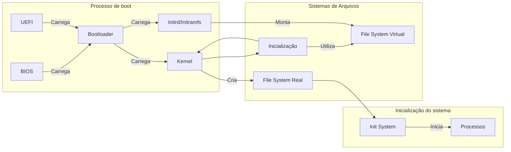
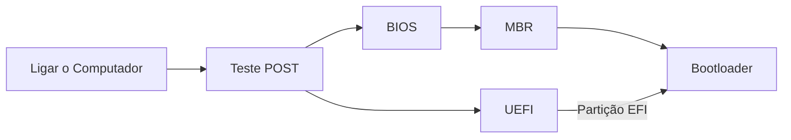

# **Sistema principal - LecOS**

Após realizarmos os [Primeiros Passos](Primeiros_Passos/base-inicial.md) do nosso Framework, iniciaremos agora a etapa definitiva, onde focaremos não na construção, mas no entendimento por trás de cada componente dos sistemas operacionais, utilizando uma distribuição mínima como base para repassarmos nos conceitos fundamentais da disciplina.

---

## **Componentes**

Este sistema contém alguns componentes a mais, possuindo uma natureza mais modular, sendo estes:

* Kernel Linux (64-bit);
* GNU Coreutils;
* Bash;
* Glibc;
* Nano;
* Ncurses;
* Util-Linux;
* GNU GRUB / Syslinux (bootloader).

Como mencionado anteriormente, o processo consistirá em passar por cada etapa do processo do sistema operacional, do `boot` até a inicialização do sistema, visando o entendimento dos conceitos e sistemas, ao invés de simplesmente entender como montar um sistema operacional.

O trabalho será desenvolvido também dentro de um container `Docker`, mas dessa vez, contaremos com um script de inicialização do ambiente visando um desenvolvimento mais dinâmico uma vez que já passamos por isso nos primeiros passos.

---

## **Fluxo**

Neste trabalho, não ficaremos presos somente nos componentes que iremos montar, mas também repassaremos em conceitos fundamentais dos sistemas operacionais, deixando nosso fluxo de trabalho da seguinte forma:



---

## **Inicialização do ambiente**

Para iniciarmos o nosso trabalho, precisamos criar o nosso ambiente de desenvolvimento. Para isso, estaremos utilizando um script para isso, o `init.sh`. Esse script contém os comandos necessários para a inicialização do container onde faremos o trabalho. Para isso, precisamos primeiramente fornecer a permissão para que ele possa ser executado, portanto, dentro do diretório (Sistema Principal)[Sistema_Principal], inserimos o seguinte comando:

```bash
chmod +x init.sh
```

Esse comando, basicamente, torna o script `init.sh` executável para o nosso sistema, possibilitando subir todo o ambiente com apenas essa instrução, tornando o _setup_ do ambiente mais prático e direto - não estamos aprendendo a subir o ambiente, mas sim a entender o sistema operacional que construiremos nele.

Após fornecer a permissão, podemos enfim iniciar nosso trabalho, ainda no diretório, executaremos:

```bash
./init.sh
```

Esse script executará os comandos necessários para deixar nosso ambiente de trabalho pronto, como:

```bash
# Cria um volume para persistência de dados
# (Pode pausar quando necessário sem perder o progresso)
docker volume create lecos_data

# Cria o container de trabalho "LecOS-dev"
# Utiliza a imagem "lecos" criada para este propósito
docker run -d --name LecOS-dev --privileged -v lecos_data:/LOS/root felpzzex/lecos:latest tail -f /dev/null
```

Por fim, o script também copia arquivos essenciais para o nosso ambiente, como o Kernel Linux já previamente compilado (no mesmo ambiente), o arquivo de inicialização e os scripts de build para cada ferramenta de nossa userland. Caso esteja interessado, pode verificar o conteúdo presente acessando o arquivo [init.sh](Sistema_Principal/init.sh).

Após a execução do script, você entrará no sistema de desenvolvimento do nosso framework, onde iremos montar a distribuição mínima enquanto nos aprofundamos nos conceitos fundamentais de um S.O.

---

## **BIOS | UEFI**

Ao aprendermos a estrutura de um sistema operacional, não podemos nos limitar somente ao software em si, uma vez que o S.O. nada mais é do que uma forma de possibilitar o ser humano de se utilizar e comunicar com o hardware através do software. Por este motivo, passaremos pelo primeiro "componente" do sistema operacional, embora não venha do software em si, mas sim o próprio hardware.

Esse processo visa, através de um teste `POST` (_Power-On Self-Test_), testar a integridade e inicialização do hardware, garantindo que este está funcionando corretamente. Após essa etapa, o sistema repassa para o firmware localiza e carrega o `bootloader` (que será aprofundado na próxima etapa), o qual coordena o processo de inicializar o software - no caso, o sistema operacional.

Os equipamentos, geralmente, utilizam dois firmwares principais: o `BIOS` (_Basic Input/Output System_), sendo o firmware legado muito utilizado antigamente, e a `UEFI` (_Unified Extensible Firmware Interface_), a alternativa moderna para a inicialização do hardware. Ambos tendo o mesmo propósito (garantir que o hardware está funcionando corretamente antes de iniciar o sistema operacional), porém utilizando abordagens diferentes, sendo a UEFI desenvolvida para "corrigir" as limitações do BIOS, sendo a principal razão dos equipamentos modernos optarem por implementar a UEFI.

### **BIOS**

Após o POST, o BIOS busca o `MBR` (_Master Boot Record_) no disco rígido. O MBR contém informações sobre a partição ativa e o código do bootloader. O BIOS, então, transfere o controle para o bootloader, que inicia o sistema operacional.

### **UEFI**

O UEFI, por sua vez, busca o bootloader em uma partição específica chamada EFI System Partition. O UEFI pode carregar múltiplos bootloaders e permite uma inicialização mais rápida e eficiente.

### **Comparativo**
| Recurso | BIOS | UEFI |
| :--: | :--: | :--: |
| Suporte a Discos | Limitado a 2 TB (MBR) | Suporta discos maiores que 2 TB (GPT) |
| Segurança | Sem suporte nativo para Secure Boot | Suporte nativo a Secure Boot |
| Interface | Texto simples | Interface gráfica moderna |
| Velocidade de Inicialização | Lenta | Rápida |
| Compatibilidade | Sistemas legados | Sistemas modernos e legados |

### **Sequência de Boot - Início**

Por fim, o fluxo inicial para iniciar o sistema consiste em:



---

## **Bootloader**

Com o hardware "acordado", o `BIOS/UEFI` passa a responsabilidade para o `bootloader`, cujo será responsável por iniciar componentes do sistema em si, carregando o `kernel` e o `initrd/initramfs`, sendo responsáveis pela inialização e por montar o sistema de arquivos virtual, respectivamente.

Neste sistema, estaremos utilizando o GNU GRUB como bootloader, sendo um componente do ecossistema GNU e principal bootloader utilizado em distribuições Linux modernas (ao lado do systemd-boot), sendo uma solução robusta e prática para a inicialização.


---

## **Kernel**


---

## **Memória Primária e Secundária**


---

## **Inicialização (Init)**


---

## **Init System**

Systemd, Runit, SysVinit...

---

## **Processos**


---

## **Entrada e Saída (E/S)**


---

## **Bônus**

Interface gráfica básica (XFCE) + abstrações...

---

## **Encerramento**