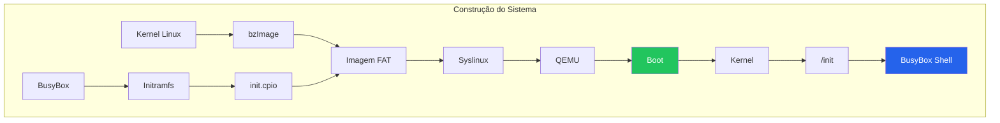

# Sistema básico - KompaktOS

Este sistema servirá de base para a construção do sistema principal do framework, uma vez que, apesar de muito abstraído, oferece uma linha de raciocínio da montagem do sistema operacional mínimo com o Kernel Linux, embora não utilize de ferramentas/componentes do ecossistema GNU.

---
## Componentes

Os componentes desse sistema mínimo são divididos em três itens:

* Kernel Linux 64-bit;
* BusyBox (userland);
* Syslinux (bootloader).

Devido ao nível elevado de abstração decorrido da utilização do BusyBox como userland (uma vez que substitui vários componentes como Coreutils em um único binário), ele não será utilizado no sistema final, mas servirá para nossa base mínima.

Além disso, a construção será feita dentro de um container docker, sendo utilizado, nesta versão, a imagem `debian:trixie-slim`.

O fluxo desse processo consiste em:



---
## Iniciando a construção

Para iniciarmos o desenvolvimento, é de extrema importância que criemos um ambiente virtual/isolado, uma vez que os comandos e tarefas realizados a seguir podem acabar afetando negativamente o seu sistema principal/host. Para isso, temos as opções de se utilizar as seguintes tecnologias:

* **Docker** - utilizando um container privilegiado (`--privileged`) e interativo (`-it`);
* **Máquina virtual** - utilizando um sistema virtualizado completo para estar realizando as etapas do tutorial.

O método fica de livre escolha do utilizador, mas por fins de praticidade, recomenda-se a utilização do container **Docker**, uma vez que já fornece o sistema isolado necessário para se realizar o trabalho completo, além de ser o método utilizado neste tutorial, facilitando o acompanhamento. A partir desse sistema virtualizado, podemos seguir com o processo.

| Método | Segurança | Praticidade | Tamanho |
| :--: | :--: | :--: | :--: |
| Container (Docker) | Boa | Excelente | Leve |
| Máquina Virtual | Excelente | Mediana | Pesado |

Dando início ao desenvolvimento do sistema, inserimos o seguinte comando para inicializar nosso ambiente isolado para o desenvolvimento do projeto:

```bash
docker run --privileged -it debian:trixie-slim
```

A diretriz `--privileged` garante ao container um acesso maior a recursos do sistema, sendo necessários em etapas importantes do sistema. Já a diretriz `-it` garante que o container será interativo, permitindo utilizar o seu terminal para baixarmos arquivos e executarmos comandos.

Já dentro do container, iniciamos a rotina atualizando o repositório de pacotes:

```bash
apt update
```

Não utilizaremos nenhum `sudo` neste sistema, uma vez que o container já nos joga como usuário `root`, facilitando o processo da construção do sistema.

Seguimos o processo para a etapa de instalação, onde estaremos fazendo o download de componentes necessários para a construção:

```bash
apt install bzip2 git vim make gcc libncurses-dev flex bison bc cpio libelf-dev libssl-dev
```

Sendo desses componentes:

* **bzip2** - Necessário para o BusyBox;
* **git** - Clone dos repositórios do Kernel Linux e do BusyBox;
* **vim** - Editar/criar arquivos;
* **make, gcc** - Necessários para a compilação;
* **flex, bison, bc, libelf-dev, libssl-dev** - Necessários para o Kernel;
* **cpio** - Componente que permite a criação do `initramfs`.
---

## Compilando o Kernel Linux

Após todos os preparativos, iniciaremos a configuração e compilação do Kernel Linux - a espinha dorsal do sistema operacional. Para isso, iniciaremos clonando o mirror do GitHub:

```bash
git clone --depth 1 https://github.com/torvalds/linux.git
```

A diretriz `--depth 1` nos garante que não clonaremos o histórico git completo, somente o último commit.

Com isso, após entrarmos na pasta `/linux` que contém o repositório clonado, iremos iniciar um pequeno ajuste inserindo o seguinte comando:

```bash
make menuconfig
```

Este comando abrirá uma interface onde, logo abaixo de "General Setup", tenha certeza de deixar a opção de "64-bit kernel" ativa (barra de espaço). Tendo feito, está tudo pronto, basta apertar a tecla `Tab` para alterar a opção para sair e `Enter` para confirmar.

Com a configuração feita, chegou a hora de compilar o Kernel Linux, utilizaremos o seguinte comando:

```bash
make -j$(nproc)
```

O comando `make` é o que inicia o processo da compilação através da configuração do Makefile presente, porém, a diretriz `-j$(nproc)` permite que utilizemos todos os núcleos presentes na máquina, auxiliando no processo de compilação para que não leve tanto tempo.

O processo de compilação serve para gerar o arquivo binário que será utilizado na construção do nosso sistema (sempre utilizamos binários para construir).

Após a compilação, nos será retornardo o caminho onde a imagem está guardada - neste tutorial, é em `arch/x86/boot/bzImage`, neste caso, criaremos uma nova pasta onde iremos armazenar os arquivos e componentes que serão utilizados na construção:

```bash
# primeiro criaremos o diretório, ainda dentro da pasta 'linux'
mkdir /boot-files

# seguido de copiar o arquivo/path do Kernel Linux compilado para ele
cp arch/x86/boot/bzImage /boot-files
```

Tendo feito isso, estaremos indo para a próxima etapa: a construção da **Userland/Userspace**.

---
## Compilando o BusyBox

Após os preparativos com o Kernel, iremos agora iniciar o processo de compilação para a criação da userland, permitindo o usuário de interagir com o sistema operacional. Para isso, vamos iniciar clonando o repositório oficial do **BusyBox**:

```bash
git clone --depth 1 https://git.busybox.net/busybox 
```

Feito o clone do repositório, iremos acessar a pasta e, assim como no Kernel Linux, faremos a configuração antes da compilação com `make menuconfig`.

Na interface, acessando a primeira opção "Settings", descendo algumas opções, encontraremos na sessão `---Build options` a opção `Build static binary (no shared libs)` desmarcada, sendo necessário habilitar para evitar utilizar bibliotecas externas.

Após, podemos sair desta tela, mas ainda resta uma configuração a ser realizada. De volta a tela inicial do `menuconfig`, mais abaixo, entraremos na opção `Network utilities` e, descendo bem a página, encontraremos o item `tc` habilitado, o que pode acabar causando algum conflito na compilação, por isso, para este tutorial, deixaremos desabilitado.

Feitas as configurações, podemos enfim compilar o BusyBox:

```bash
make -j$(nproc)
```

Após a compilação, criaremos o diretório do `initramfs`, onde instalaremos o BusyBox que compilamos:

```bash
# criamos o diretório
mkdir /boot-files/initramfs

# em seguida, instalamos o BusyBox com o comando 'make install'
# 'CONFIG_PREFIX': serve para passar o local onde será instalado
make CONFIG_PREFIX=/boot-files/initramfs install
```

O diretório `initramfs` é o que será carregado pelo Kernel logo após o boot, por isso colocaremos o BusyBox nele - no processo, ele já cria partes do rootfs, sendo as pastas `bin, sbin e usr`.

---
## Sistema de inicialização

Tendo o Kernel e a userland (BusyBox) compilados, iremos criar então o sistema de inicialização. Dentro da pasta `/boot-files/initramfs`, iremos criar um arquivo de init simples.

```bash
vim init
```

Dentro da interface do Vim, apertaremos a tecla `I` para podermos criar o arquivo de init - arquivo este que o Kernel procura após carregar o `initramfs`.

Neste arquivo, iremos configurar para inicializar o `shell`:

```
#!/bin/sh

/bin/sh
```

Basicamente, os símbolos `#!` indicam ao Kernel a utilizar o binário indicado - `/bin/sh` - para executar/iniciar o comando/componente indicado, que no caso, é o próprio shell.

Feito isso, podemos sair do editor apertando a tecla `Esc`, seguido de `: + wq`, onde `:` ativa a sessão de comandos e `wq` significa 'Write and Quit', salvando nosso arquivo de init e saindo do editor.

Logo após, precisamos dar permissão de execução para o arquivo, uma vez que ele atuará como um script, o sistema necessita de que ele tenha a autoridade para ser executado, nos levando a:

```bash
chmod +x init
```

Onde `chmod` é o comando utilizado para alterar permissões de arquivos e diretórios, `+x` sendo a permissão adicionada (+) a de execução (x) e `init` o nome do nosso arquivo.

Em seguida, criaremos nosso arquivo de inicialização através do `cpio` utilizando todos os arquivos presentes no diretório atual `initramfs`:

```bash
find . | cpio -o -H newc > ../init.cpio
```

Onde pegamos todos os arquivos da pasta atual (`find .`), transformamos no tipo de arquivo que o Kernel suporta (`-H newc`) através do cpio, inserindo tudo em um novo arquivo (`> ../init.cpio`), gerando nosso arquivo de inicialização.

---
## Bootloader

Nesta última etapa, estaremos configurando o Bootloader do nosso sistema, responsável por inicializar o Kernel e, por tabela, o sistema em si. Neste tutorial, estaremos iniciando o Syslinux.

```bash
apt install syslinux
```

Com o bootloader instalado, podemos criar o arquivo de boot. Para isso, utilizaremos o seguinte comando para iniciar este arquivo:

```bash
dd if=/dev/zero of=boot bs=1M count=50
```

Simplificando, o comando nos permite criar um arquivo de 50MB * preenchido de zeros. Mas sendo mais técnico: 
* ele utiliza a ferramenta `dd` que serve para copiar dados brutos de uma origem para um destino;
* nesse caso, a origem (`input file/if`) sendo `/dev/zero` que contém infinitos zeros e o destino (`output file/of`) sendo `boot`, que será preenchido com zeros;
* com isso, o arquivo se torna uma espécie de "imagem de disco virtual";
* por fim, especificamos o tamanho dos blocos que serão copiados (`bs=1M`), espeficiando a copiar os zeros em blocos de 1MB, e a quantidade total de blocos (`count=50`), resultando em 50 blocos de 1MB - totalizando 50MB.

Após criarmos o arquivo de boot (ainda não finalizado), podemos configurar o sistema de arquivos dele. Por utilizarmos Syslinux, estaremos utilizando o sistema FAT por ser o sistema que ele suporta.

```bash
# primeiro, instalamos:
apt install dosfstools

# feito isso, rodaremos o seguinte comando para configurar o sistema em nosso arquivo de boot:
mkfs -t fat boot
```

Onde `mkfs` "formata" o arquivo/dispositivo para que possa armazenar arquivos/diretórios, `-t` é a flag para indicarmos o tipo e `fat` o tipo de filesystem que desejamos, sendo configurados em nosso arquivo `boot`.

Após isso, podemos enfim configurar o nosso bootloader dentro do arquivo, uma vez que este apresenta um filesystem válido. Com o Syslinux já instalado, executamos o seguinte comando:

```bash
syslinux boot
```

Que, basicamente, indica para instalar o `Syslinux` no filesystem FAT presente no arquivo `boot`, completando assim o nosso arquivo de boot contendo o bootloader.

---
## O boot

Finalizando o processo, iremos enfim fazer o boot do nosso sistema. Para isso, precisamos copiar o Kernel e o initramfs para dentro do arquivo de boot, sendo feito de uma maneira bem simples:

```bash
# primeiro, criamos um diretório novo para trabalharmos em cima
mkdir m # pode ser qualquer nome

# em seguida, iremos montar o arquivo de boot neste diretório
mount boot m 
# pode ser que haja algum erro ao montar, nesse caso, tente:
mount -o loop boot m
# se ainda der erro: 
mknod /dev/loop0 b 7 0
chmod 660 /dev/loop0
mount -o loop boot m

# copiaremos o Kernel e o initramfs no filesystem do boot
cp bzImage init.cpio m

# por fim, podemos desmontar o arquivo do diretório
umount m
```

Em caso de erros, irei detalhar um pouco os comandos repassados acima para melhor entendimento:

`mknod` indica a criação de arquivos especiais de dispositivos, sendo `/dev/loop0` o nome deste que estaremos criando, `b` é a flag para criar como 'arquivo de bloco', e `7 e 0`:

* major = 7 -> driver loop
* minor = 0 -> loop0

Além disso, considere montar e desmontar (`mount & umount`) como "plugar e desplugar um pendrive". O arquivo de boot, por si só, não nos permite "editar" ou acrescentar arquivos dentro dele normalmente, como o Kernel Linux compilado e o arquivo `init.cpio`, por isso, precisamos montar ele em uma pasta para que os arquivos sejam exibidos no diretório e que nos permita adicionar o que for necessário.

Seguindo o fluxo do processo, seria algo basicamente:

| Diretório\Estado | Conteúdo |
| :--: | :--: |
| m (desmontado) | - vazio - |
| m (boot montado) | ldlinux.c32 ; ldlinux.sys |

Copiamos então o kernel compilado e o `init.cpio` para dentro do diretório com o comando `cp`.

| Diretório\Estado | Conteúdo |
| :--: | :--: |
| m (boot montado) | bzImage ; init.cpio ; ldlinux.c32 ; ldlinux.sys |

Com boot, agora, possuindo o kernel compilado e o `init.cpio`, podemos enfim "desplugar" ele de 'm'.

| Diretório\Estado | Conteúdo |
| :--: | :--: |
| m (boot montado) | bzImage ; init.cpio ; ldlinux.c32 ; ldlinux.sys |
| m (desmontado) | - vazio - |

Esta sequência nos retorna um arquivo de boot funcional, nos permitindo enfim dar boot em nosso sistema, o que será feito em nosso sistema host, fora do Docker - mas não feche/encerre o container ainda!

---
## Iniciando o sistema

Chegamos, enfim, na etapa final do processo, realizar o boot do nosso sistema minimalista, para isso, estaremos utilizando o sistema `qemu`, que verá nosso arquivo e irá executar em uma máquina virtual, por isso, garanta que, no sistema host (em um novo terminal, para não fechar/encerrar o docker), você tenha o `qemu` instalado:

```bash
# em distribuições Debian e derivadas
sudo apt install qemu-system-x86

# em distribuições Fedora e derivadas
sudo dnf install qemu-system-x86
```

Feita a instalação do qemu, podemos iniciar a etapa final. Ainda no mesmo terminal, para fins de organizações, entre na pasta de Documentos e crie uma nova pasta chamada 'sistema' e entre na mesma. Em seguida, rode o comando:

```bash
docker ps
```

Para o comando a seguir, precisaremos do ID do container, que ficará embaixo do título `CONTAINER_ID`, algo como 'a94abe6c119f', por exemplo.

Em seguida, faremos a cópia do nosso arquivo de boot dentro do container para o diretório que criamos utilizando o seguinte comando:

```bash
docker cp [CONTAINER_ID]:/boot-files/boot .
```

Que basicamente irá copiar, do container especificado, o arquivo `boot` do diretório `/boot-files` e armazenará na pasta atual (.), completando assim a cópia do nosso arquivo de boot.

Agora, com o arquivo em mãos, podemos enfim rodar em nosso sistema principal utilizando o qemu, iniciando a máquina virtual através do comando:

```bash
qemu-system-x86_64 boot
```

Que iniciará o serviço do qemu na arquitetura `x86_64` e utilizará o arquivo de boot para iniciar o sistema, o que abrirá uma nova interface da máquina virtual rodando.

Por fim, na sessão de boot, o Syslinux aguarda a imagem do Kernel e o arquivo de init, devendo ser digitado no campo: `/bzImage -initrd=/init.cpio`. Feito isso, o sistema irá carregar e, enfim, bootar.

---
# **PARABÉNS!**

Se você acompanhou o tutorial direito e não ocorreu nenhum erro, você agora tem um Sistema Operacional com kernel Linux minimalista e funcional! Claro, não é algo que se pode chamar de "utilizável no dia a dia", porém não tira o mérito de que ele de fato possui as funcionalidades básicas de uma distribuição (graças ao BusyBox), além de ensinar um pouco mais a fundo como os sistemas são montados e configurados. Esse sistema mínimo será a base do sistema completo que servirá de base ao framework didático. Que sua jornada tenha sido proveitosa e que tenha adquirido um bom conhecimento no geral, nos veremos em breve!

* Autor: Felipe Fialho - TCC-I
* Orientador: Igor Muzetti Pereira
* Coorientador: Samuel Souza Brito
* Universidade Federal de Ouro Preto - UFOP

* Tutorial de base: [Making Simple Linux Distro from Scratch - Nir Lichtman](https://www.youtube.com/watch?v=QlzoegSuIzg)